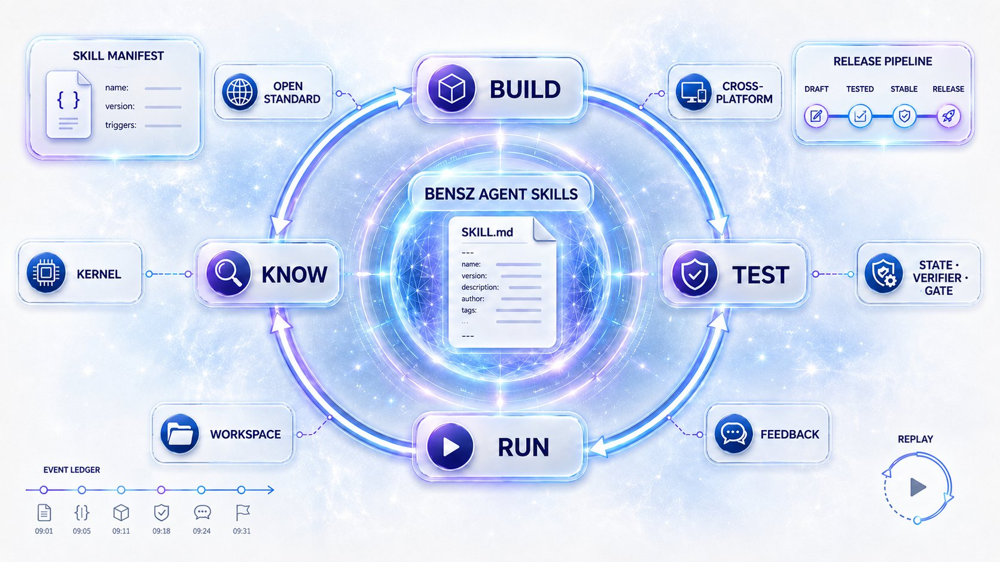

<div align="center">

# Bensz Agent Skills

**让 Agent Skill 从文件，变成系统。**

一套遵循 [Agent Skills 开放标准](https://agentskills.io) 的可复用 Skill 集合、开发流水线，以及帮助检查和追踪 Skill 执行过程的工具。

[](https://agentskills.io)
[](#兼容性与边界)
[](#兼容性与边界)
[](LICENSE)

[快速开始](#30-秒开始) · [Skill 导航](#skill-导航) · [Kernel](#kernel) · [开发与验证](#开发与验证) · [English](README_EN.md)

</div>

这不只是一个 `SKILL.md` 文件集合。它把 Skill 的创建、测试、文档、安装与发布连成可复用的工程流程，并进一步探索：当 Skill 成为 Agent 系统的长期组成部分时，怎样确认它仍在按预期工作。



## 项目在做什么

项目由三部分组成：

- **可直接使用的通用 Skills**：覆盖自动测试、多 Agent 协作、并行工作区、Prompt 优化、科研绘图、Git 操作、安装、文档和缺陷反馈。
- **Skills 开发与维护流水线**：用统一约定串起开发 → 测试 → 文档化 → 安装 → 使用 → 反馈 → 迭代。
- **Skill 执行与检查工具**：`bensz-skill-kernel` 正在提供任务阶段管理、自动检查、工作区、证据记录、事件账本、审计和执行记录重放。

这些工具不试图把 Skill 变成传统程序，而是让复杂 Agent 工作流中的关键阶段、检查和证据更明确、更容易追踪。

## 为什么做这个项目

当 Skill 数量和流程复杂度增长，仅靠更长的 `SKILL.md` 很难回答：Skill 是否正确触发、是否遗漏步骤、修改后是否退化、协作过程是否可追踪、结果经过了哪些检查，以及失败发生在哪里。本项目因此尝试把关注点从“编写单个 Skill”推进到更完整的 **系统化建设 Skill**。

## 设计原则

- 开放标准优先，尽量不绑定单一平台。
- Skill 与通用工具分离：具体工作流程留在 Skill，通用的执行、检查和记录功能放在 Kernel。
- 显式状态优于隐式猜测，检查优于默认信任，可重放优于不可追踪。
- 渐进增强：普通 Skill 保持简单，仅在需要时使用更强的执行和检查功能。

## 30 秒开始

无需克隆仓库即可安装 `skills/alpha` 中的生产 Skill（需要 Python 3.8+ 与网络）：

```bash
python3 -c "import urllib.request; exec(urllib.request.urlopen('https://raw.githubusercontent.com/huangwb8/skills/main/skills/alpha/install-bensz-skills/scripts/bootstrap_install.py').read())" --source general
```

已克隆仓库、需要本地开发时：

```bash
python3 skills/alpha/install-bensz-skills/scripts/install.py --codex
```

安装器默认把 Skill 复制到 `~/.codex/skills/` 和 `~/.claude/skills/`；只安装某个 Skill 可追加 `--skill git-commit`。`skills/beta/` 仅在显式传入 `--source` 时处理。

## 这个仓库提供什么

- **可直接安装的 Skill**：位于 `skills/alpha/`，每个目录都有面向使用者的 `README.md` 和面向 AI 的 `SKILL.md`。
- **开发流水线**：覆盖初始化、Prompt 优化、文档生成、批判性测试、多代理协作、Git 发布和缺陷反馈。
- **任务执行内核**：`packages/bensz-skill-kernel/` 提供 `bsk` CLI，用来管理任务阶段、执行检查、保存证据、记录事件，并重放执行记录。
- **可审计协作**：任务过程材料进入 `.bensz-api/`，贡献记录进入 `docs/contribution.bac`。

## Skill 导航

当前 `skills/alpha/` 包含 15 个生产 Skill：

| 方向 | Skill |
| --- | --- |
| 初始化与文档 | `init-project` · `write-readme` |
| 测试与协作 | `auto-test-code` · `auto-test-skill` · `auto-test-project` · `awesome-code` · `parallel-vibe` |
| Prompt 与创作 | `better-prompt` · `auto-draw-plot` · `compact-bensz-skills` |
| 安装与版本 | `install-bensz-skills` · `git-commit` · `git-pr-review` · `git-publish-release` |
| 治理 | `bensz-collect-bugs` |

选择 Skill 后，阅读对应目录的 `README.md` 获取触发方式、最小 Prompt、输入输出和 FAQ；维护者同时阅读 `SKILL.md`、`config.yaml` 与 `CHANGELOG.md`。

当然，我觉得最好的方式是：**在你的Codex/Claude Code里把本项目的地址粘贴上，然后开始用ai来探索它！**

## 安装方式

### 远程引导安装

`bootstrap_install.py` 只依赖 Python 标准库，最低 Python 3.8；它是仓库唯一兼容 Python 3.8、3.9 和 3.10 的首次/应急入口，该兼容范围不代表本地完整安装器或 Kernel 支持这些版本。默认远程源由 `skills/alpha/install-bensz-skills/config.yaml` 定义：

| 源 | 内容 |
| --- | --- |
| `general` | 本仓库 `skills/alpha` |
| `research` | `huangwb8/ChineseResearchLaTeX` 的科研 Skill |
| `anthropic-docs` | `anthropics/skills` 的文档处理 Skill |

常用参数：

```bash
# 预览，不写入文件
python3 -c "import urllib.request; exec(urllib.request.urlopen('https://raw.githubusercontent.com/huangwb8/skills/main/skills/alpha/install-bensz-skills/scripts/bootstrap_install.py').read())" --check

# 只安装到 Codex 或 Claude Code
python3 -c "import urllib.request; exec(urllib.request.urlopen('https://raw.githubusercontent.com/huangwb8/skills/main/skills/alpha/install-bensz-skills/scripts/bootstrap_install.py').read())" --codex
python3 -c "import urllib.request; exec(urllib.request.urlopen('https://raw.githubusercontent.com/huangwb8/skills/main/skills/alpha/install-bensz-skills/scripts/bootstrap_install.py').read())" --claude
```

### 本地安装与开发

本地完整安装器与仓库标准开发环境统一使用 Python 3.11+，支持 `--source`、`--skill`、`--force` 和 `--legacy-source` 等参数：

```bash
git clone https://github.com/huangwb8/skills.git
cd skills
python3 skills/alpha/install-bensz-skills/scripts/install.py
python3 skills/alpha/install-bensz-skills/scripts/install.py --skill write-readme
```

安装记录、MD5 清单和远程缓存位于用户目录的 `~/.bensz-skills/installation/`；安装器不会把 beta Skill 混入默认源。

## Kernel

`bensz-skill-kernel` 要求 Python 3.11+，运行所需的依赖只有 PyYAML 和 Python 标准库。它是独立包，不是安装 Skill 的前置依赖。

它提供 `bsk` 命令，帮助你管理任务阶段、执行检查、保存证据和重放执行记录。普通使用者可以直接使用上面的命令；内部的 State、Verifier、Workspace 等概念主要面向维护者，详细说明见 [`docs/state-id-naming.md`](docs/state-id-naming.md)、[`docs/verifier-id-naming.md`](docs/verifier-id-naming.md) 与 [`packages/bensz-skill-kernel/README.md`](packages/bensz-skill-kernel/README.md)。

```bash
python3 -m venv .bensz-api/.venv
.bensz-api/.venv/bin/python -m pip install -e packages/bensz-skill-kernel
.bensz-api/.venv/bin/bsk --version
.bensz-api/.venv/bin/bsk verifier list
```

常用入口：

```bash
bsk state list
bsk verifier list --tag citation
bsk workspace init . --description citation-review
bsk workspace status .bensz-api/task-YYYYMMDD-HHMM-citation-review
```

## 目录与工作区

```text
skills/alpha/                  # 可发布、默认安装的 Skill
skills/beta/                   # 候选 Skill，必须显式指定源
packages/bensz-skill-kernel/   # 独立 Python 内核包
docs/                          # 现行文档、教程与设计记录
tests/                         # 仓库公开入口与跨包测试
tmp/                           # 测试报告和临时产物
.bensz-api/                    # AI 任务工作区与工具缓存
```

每个需要落盘的逻辑任务使用一个 `.bensz-api/task-{yyyymmdd-hhmm}-{描述}/`；正式 README、源代码和计划仍写入项目约定目录，不放入隐藏工作区。

## 开发与验证

```bash
# 根级测试（缓存写入 .bensz-api）
python3 -m pytest

# 检查中英文 README 标题、代码块、链接和命令 token 是否对齐
python3 skills/alpha/write-readme/scripts/check_readme_pair.py README.md README_EN.md

# 报告所有 alpha/beta Skill 的正文规范缺项；迁移后的 Skill 可加 --mode strict
python3 skills/alpha/auto-test-project/scripts/check_skill_structure.py --mode report

# 查看 BAC 贡献账本
bac --root . --bac-file docs/contribution.bac inspect
```

修改 Skill 时保持 `SKILL.md`、`config.yaml`、README 和 CHANGELOG 同步；重要仓库变更先记录到 `CHANGELOG.md` 的 `[Unreleased]`。

## 兼容性与边界

- Agent Skills 文件格式遵循开放标准；实际触发能力取决于宿主对 Skill 目录的支持。
- 仓库开发、本地完整安装器和 Kernel 统一要求 Python 3.11+；仅远程 bootstrap 为首次/应急安装保留 Python 3.8+ 兼容。
- Kernel 的进程级超时、输入输出限制和 fail-closed 选项不是容器或操作系统沙箱；不可信代码仍应在独立环境运行。
- 远程安装需要访问 GitHub；网络失败时可改用本地安装器或已有缓存，并检查安装退出码。

## 贡献与许可证

请先阅读 [`AGENTS.md`](AGENTS.md) 和 [`CLAUDE.md`](CLAUDE.md)。本项目暂不接受未经沟通的普通 PR；如需贡献，请先联系 [huangwb8](https://github.com/huangwb8)。

项目采用 MIT License，见 [`LICENSE`](LICENSE)。

## 更多入口

下面这些入口分别介绍版本变化、结果检查、任务阶段和 Skill 安装；按你的目标选择即可。

- [`CHANGELOG.md`](CHANGELOG.md)：这是项目的更新日志，记录每次版本的新增功能、修复问题和重要调整；想了解最近改了什么，可以先看这里。
- [`docs/verifier-tutorial.md`](docs/verifier-tutorial.md)：这是一份结果检查教程，用完整示例说明系统如何检查结果、处理失败并记录证据；想看一次检查具体怎样完成，可以从这里开始。
- [`docs/state-machine-tutorial.md`](docs/state-machine-tutorial.md)：这是一份任务阶段教程，说明任务如何流转，以及系统如何保存和恢复执行进度；想理解任务是怎样一步步推进的，可以阅读这份文档。
- [`skills/alpha/install-bensz-skills/README.md`](skills/alpha/install-bensz-skills/README.md)：这是 Skill 安装器的使用指南，介绍安装方式、参数和常见用法；准备安装 Skill 时，可以按这份指南操作。
- [`docs/templates/skill-body.md`](docs/templates/skill-body.md)：这是新建或修改 Skill 时使用的四段式正文骨架。
- [`docs/templates/skill-common-constraints.md`](docs/templates/skill-common-constraints.md)：这是工作区、BAC、隐私和缺陷协作的公共约束长版本。
