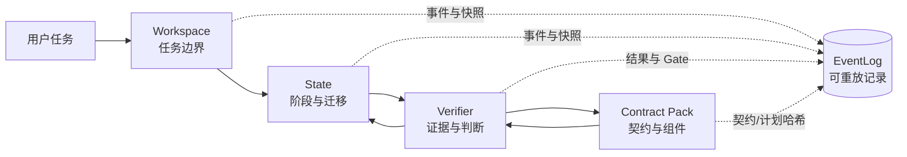
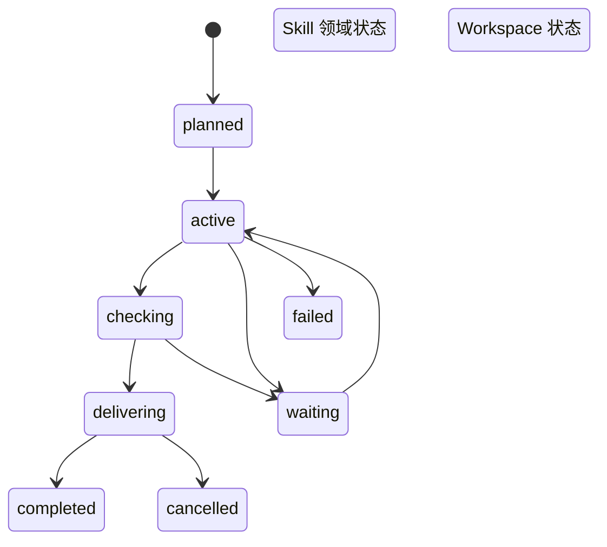
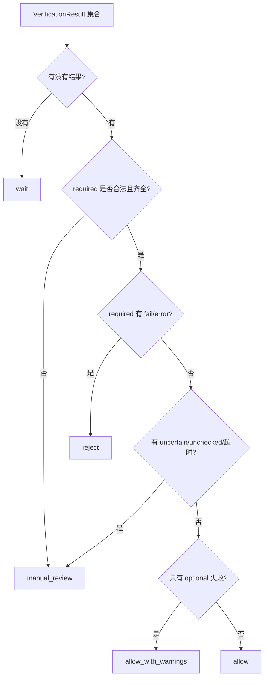
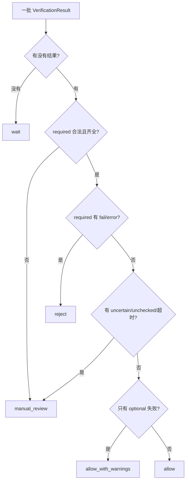
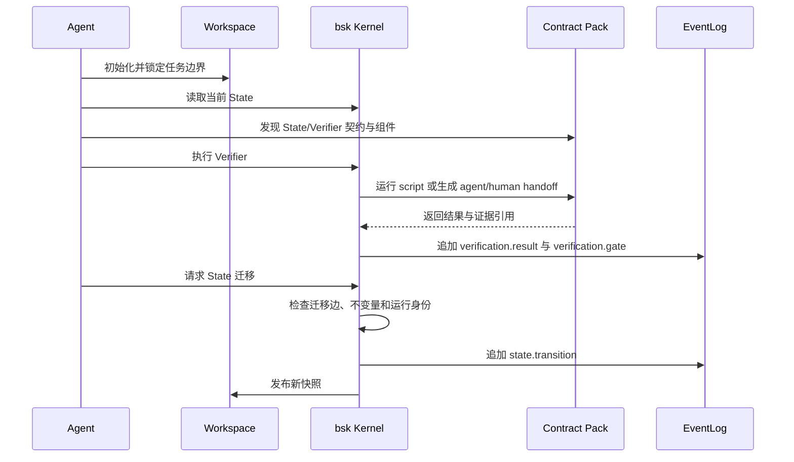

# bsk 教程：四种重要抽象

`bsk` 是 Bensz Skill Kernel 的命令行入口。它不替 Skill 完成领域工作，而是提供一套可以被不同 Skill、Agent 和宿主复用的运行时抽象：任务边界、阶段推进、证据检查，以及把契约组织成可发现的执行包。

这篇教程只记住一句话：

> `Workspace` 管“在哪里工作”，`State` 管“工作进行到哪一步”，`Verifier` 管“凭什么认为它成立”，`Contract Pack` 管“这些规则和执行组件如何被发现、运行和审计”。

一次典型任务可以这样理解：



四种抽象可以组合使用，也可以按需求只使用其中一部分。没有明确采用 State 或 Verifier 时，不需要为了“看起来完整”额外引入它们。

## Workspace：贯穿全流程的任务边界

## 它代表什么

`Workspace` 是一次任务的物理和治理边界。它回答的不是“任务做得好不好”，而是：

- 哪个目录属于这次任务；
- 中间文件、日志和快照应该写在哪里；
- 当前是否允许继续写入；
- 任务是否已经关闭，后续操作是否应被拒绝。

在本仓库中，AI 任务工作区通常位于 `.bensz-api/task-{yyyymmdd-hhmm}-{description}/`。它与最终交付物不同：工作区保存过程材料，正式文档、源代码和报告仍放在项目约定的位置。

## 一个通俗例子

把 Workspace 想成装修房屋时围起来的施工区域。施工队可以在区域内放工具、记录进度和暂存材料；区域外的住户文件不能随意覆盖。施工结束后，施工区被封存，不能再把新材料偷偷放进去改变历史记录。

## 它不代表什么

Workspace 不是：

- 领域状态，例如“草稿”“已审核”“已发布”；
- Verifier 的通过结果；
- 对用户项目目录的无限写入许可；
- 操作系统级别的安全沙箱。

Kernel 的路径和进程限制是运行时保护，不等于容器或操作系统隔离；不可信代码仍应放到独立环境运行。

## 如何使用

初始化任务工作区：

```bash
bsk workspace init . --description citation-review
```

Workspace 的生命周期通常与事件账本一起使用。任务级 `events.ndjson` 是可重放的事实来源，`state.json` 是由事件投影出的当前视图；工作区快照缺失时，可以根据事件恢复。

# 一、State：阶段与迁移

## 它代表什么

`State` 表示某个阶段已经成立的事实，以及从当前阶段可以合法前往哪些阶段。它不是一个“请 AI 执行这段文字”的脚本，而是一套阶段契约：

- `entry_conditions`：进入前必须具备什么；
- `invariants`：离开前必须持续满足什么；
- `transitions`：允许前往哪些目标状态；
- `STATE.md` 正文：告诉 Agent 这个阶段意味着什么、要做什么、留下什么证据；
- 可选执行组件：在需要时运行确定性检查或交给 Agent/人工复核。

Kernel 内置运行生命周期包括 `planned`、`active`、`waiting`、`checking`、`delivering`、`completed`、`failed` 和 `cancelled`。`workspace.ready` 与 `workspace.closed` 是工作区系统状态；Skill 自己还可以声明领域状态。

## 一个通俗例子

把 State 想成机场流程：

| State 概念 | 机场例子 |
| --- | --- |
| 状态 | 已值机、安检中、已登机 |
| 迁移 | 从“已值机”进入“安检中” |
| 进入条件 | 必须先有登机牌 |
| 不变量 | 离开安检前必须完成安全检查 |
| 终态 | 旅程完成、失败或取消 |

AI 不能只说“我已经检查过了”就把状态改成下一阶段。若契约要求 Verifier 结果和 Gate，它必须先留下对应事件，再由 Kernel 检查迁移是否合法。

## 状态如何叠加

一次任务同时可能有三类状态，它们不是同一个状态机：



运行生命周期记录任务整体进度；领域 State 记录 Skill 的业务阶段；Workspace 状态记录任务边界是否仍开放。Verifier 结果可以成为领域状态迁移的证据，但 Verifier 本身不是 State。

## 如何定义与操作

领域状态通常放在 Skill 的 `references/states/<state>/STATE.md`，并由 `config.yaml.runtime` 声明。一个简化的契约可以是：

```text
id: bensz.example.review.reviewed
entry_conditions: bensz.example.review.checking
invariants: verifier-result-recorded, required-verifiers-pass
transitions: bensz.example.review.published
```

查看、检查和持久化迁移：

```bash
bsk state list
bsk state describe bensz.workspace.ready
bsk state check bensz.workspace.ready org.example.skill.collecting --skill-root path/to/skill
bsk state transition .bensz-api/task-YYYYMMDD-HHMM-citation-review skill-name org.example.skill.collecting \
  --skill-root path/to/skill --context-json '{"input":"report.md"}'
```

迁移成功后，Skill 级快照通常写入 `<skill>/log/meta-state.json`，任务级事实写入 `log/events.ndjson`。快照便于快速读取，事件才是用于审计和重放的主要来源。

# 二、Verifier：证据与判断

## 它代表什么

`Verifier` 是一个可审计的判断契约。它回答一个命题是否成立，例如：

- 文件是否存在；
- 路径是否仍在允许范围内；
- Markdown 链接是否完整；
- 产物是否符合 Schema；
- required Verifier 是否全部通过。

Verifier 不等于“一个返回布尔值的函数”。标准结果同时说明检查是否真正执行、命题结论是什么、用了哪些证据，以及结论具有什么保证等级。

## 一个通俗例子

把 Verifier 想成机场安检员：安检员不能因为旅客说“我没带危险品”就盖章，而要依据扫描结果、证件和检查规则作出判断。扫描器坏了、证据缺失或需要人工判断时，正确结果是“无法完成检查”，而不是擅自改成“通过”。

## 输入与输出

标准请求由 `VerificationRequest` 表示，常见字段包括：

| 字段 | 代表什么 |
| --- | --- |
| `subject` | 被判断的对象，例如文件或状态迁移 |
| `requirements` | 必须满足的要求 |
| `evidence` | 带来源、时间和内容哈希的证据快照 |
| `context` | 允许路径、Schema、超时等只读参数 |
| `request_id` | 本次检查的稳定标识 |

标准结果由 `VerificationResult` 表示。`execution_status` 说明检查有没有正常执行，`verdict` 说明命题是否成立：

| `execution_status` | 典型 `verdict` | 含义 |
| --- | --- | --- |
| `completed` | `pass` / `fail` / `uncertain` | 检查完成并给出结论 |
| `unchecked` | `unchecked` | 没有实际完成检查 |
| `timed_out` | `timed_out` | 超过时间限制 |
| `error` | `error` | 执行或协议出错 |
| `skipped` | `skipped` | 按显式策略跳过 |

Kernel 禁止“未完成但通过”：只有 `execution_status: completed` 才能产生 `pass`。

## Gate 如何决定是否放行

一个 Verifier 给出局部结果，Gate 负责对一批结果应用策略：



因此，多次 `pass` 不能投票覆盖一个 required 的确定性失败；`unchecked` 也不是宽松意义上的通过。

## 如何运行

查看内置 Verifier：

```bash
bsk verifier list
bsk verifier describe bensz.contract.conformance --version 1.0.0
bsk verifier run bensz.document.markdown-link-integrity \
  --version 1.0.0 --input README.md
```

如果需要审计记录，可增加 `--events EVENTS --run-id RUN_ID --attempt-id ATTEMPT_ID`。Agent/人工组件没有回传绑定结果时，Kernel 会保留 `unchecked` 或 `wait`，不会伪造完成。

# 三、Gate：把多个判断变成放行决定

## 它代表什么

`Gate` 不是另一个 Verifier，而是对一批 `VerificationResult` 应用放行策略的决策层。Verifier 回答局部命题，Gate 回答这些结果是否足以继续某个阶段、完成任务或交付产物。

## 一个通俗例子

把 Verifier 想成几位安检员，把 Gate 想成登机口值班主管。每位安检员只负责自己的检查；主管要确认必需检查是否齐全、是否有失败或不确定结果，以及是否需要人工复核。一个安检员通过，不能覆盖另一个必需检查的失败。

## 当前决策规则



`apply_gate()` 的核心结果是 `wait`、`manual_review`、`reject`、`allow_with_warnings` 或 `allow`。缺失 required 结果、版本不匹配、执行不确定和非法要求都会 fail-closed，不能被 Agent 改写成通过。

## 它如何影响 State

Gate 结果通常作为 State 不变量的证据。只有 required Verifier 全部在同一 `run_id`/`attempt_id` 下完成并通过，且 allowing Gate 覆盖这些结果，状态才可以满足 `required-verifiers-pass`；Gate 自己不负责修改 State。

## 如何观察

Verifier CLI 会输出结构化的 `results` 和 `gate`；需要审计时可用 `--events EVENTS` 写入 `verification.result` 与 `verification.gate` 事件。

# 四、Contract Pack：契约如何成为可执行单元

## 它代表什么

`Contract Pack` 是把一项 State 或 Verifier 组织成可发现、可版本化、可执行和可审计单元的目录。一个 Pack 通常包含：

```text
<pack>/
├── STATE.md 或 VERIFIER.md
├── scripts/verify.py       # 可选的 script 组件
└── index.json               # Pack 集合的目录索引
```

索引记录稳定 ID、版本、alias、分类、标签、契约路径、执行模式和有序组件。组件可以是：

- `script`：Kernel 在 Pack 目录内执行的确定性入口；
- `agent`：由外部宿主执行并回传绑定结果；
- `human`：需要人工复核的步骤。

旧式单一 `entrypoint` 仍兼容，但新设计鼓励显式声明 `components`，让执行计划、required 标记、证据依赖和副作用边界可被检查。

## 一个通俗例子

如果 State 是“机场安检中”这条规则，Contract Pack 就是整套安检工作包：规则手册、扫描器、人工复核台、版本号和工作顺序都在同一个可发现目录中。换一台机场设备，只要遵守同一份输入输出契约，流程仍然可以被 Kernel 统一调度和审计。

## 为什么需要它

没有 Pack，Agent 只能凭文件名和自然语言猜测规则；有了 Pack，Kernel 可以：

1. 根据 canonical ID 和版本发现契约；
2. 校验组件是否在允许目录内；
3. 约束 JSON-stdio 输入输出、超时和输出大小；
4. 绑定契约哈希、计划哈希、组件哈希和运行身份；
5. 对缺失、超时、非法 JSON 或不确定结果 fail-closed；
6. 将结果、Gate、handoff 和事件保存下来以便重放。

## State Pack 与 Verifier Pack 的区别

两者共享发现、索引、哈希、组件执行和审计底层，但解释结果的上层语义不同：

| Pack 类型 | 它解释什么 |
| --- | --- |
| State Pack | 当前阶段能否进入、离开或迁移 |
| Verifier Pack | 某个命题是否成立，以及 Gate 是否放行 |

共享执行器不会把 State 的阶段语义和 Verifier 的 verdict 混成一个对象。

## 四种抽象如何协作

一次“生成报告并交付”的任务可以这样走：



最重要的边界是：

- Agent 负责理解任务、生成内容和决定何时请求检查；
- Contract Pack 负责把规则与组件组织成稳定接口；
- Verifier 负责产生可审计判断；
- State 负责阶段迁移；
- Workspace 负责限制过程材料的归属和生命周期；
- EventLog 负责留下可重放的事实，而不是重新执行模型或工具。

## 常见误解

## “State 就是待办清单”

不是。待办清单描述要做什么，State 描述哪些事实已经成立，以及下一步是否被允许。

## “Verifier 通过了就代表任务完成”

不是。Verifier 只回答局部命题；任务完成还要满足 State、required 结果、allowing Gate、产物和交付契约。

## “有一份 VERIFIER.md 就已经执行过检查”

不是。契约正文只是规则说明。没有实际组件结果时，Kernel 应返回 `unchecked`、`wait` 或其它失败闭合结果。

## “快照就是事实来源”

不是。快照是便于读取的投影；事件账本才是用于审计、重放和检测漂移的事实来源。

## “Contract Pack 是另一种 State 或 Verifier”

不是。Pack 是组织和执行契约的容器；State 与 Verifier 是其中两种不同的领域语义。

## 从哪里开始

如果你只是使用现有 Skill：

```bash
bsk --version
bsk state list
bsk verifier list
```

如果你正在开发 Skill：

1. 先创建并锁定 Workspace；
2. 只在确实需要阶段治理时声明 State；
3. 只为可验证的命题声明 Verifier；
4. 用 `STATE.md`/`VERIFIER.md` 和索引创建 Contract Pack；
5. 让 Kernel 写入事件与快照，不要手工伪造通过结果。

更细的规范请继续阅读 [`docs/state-id-naming.md`](state-id-naming.md)、[`docs/verifier-id-naming.md`](verifier-id-naming.md)、[`docs/bensz-api-workspace.md`](bensz-api-workspace.md) 和 [`packages/bensz-skill-kernel/README.md`](../packages/bensz-skill-kernel/README.md)。
