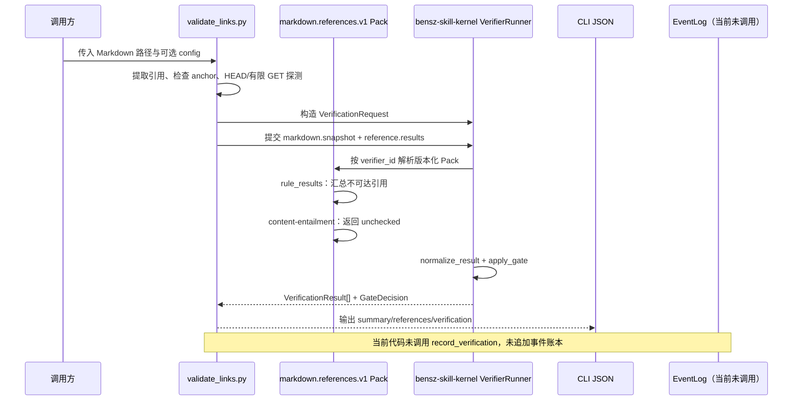

# `validate-md-ref` 与状态机、Verifier 系统交互调查报告

调查日期：2026-08-26  
调查对象：`skills/beta/validate-md-ref` 当前工作树改造内容，以及 `packages/bensz-skill-kernel` 的状态机和 Verifier 原型

## 结论摘要

这次改造完成了 **Skill → Verifier Runner** 的单向接入，但还没有完成 **Verifier → 状态机事件账本** 的自动闭环。

- `validate-md-ref` 仍由自己的脚本负责 Markdown 引用提取、站内锚点检查和 HTTP(S) 可达性探测。
- 脚本随后构造 `VerificationRequest`，把 Markdown 快照和引用结果作为 `Evidence`，调用版本化的 `markdown.references.v1@1.0.0` Pack。
- Pack 以 `hybrid` 模式运行：确定性规则判断链接是否可达；语义判断组件明确返回 `unchecked`，不把“URL 能打开”冒充为“来源支持正文论断”。
- `VerifierRunner` 标准化结果并计算 Gate：确定性失败为 `reject`，没有确定性失败但存在语义缺口为 `manual_review`。
- CLI 将这些结果放进新增的 `verification` JSON 字段，同时保留既有的 `summary` 和 `references` 字段，兼容旧调用方。
- 状态机内核已经能够追加并重放 `verification.result`、`verification.gate` 事件，但当前 `validate_links.py` 只打印 JSON，没有调用 `EventLog.record_verification()`；因此验证结果目前是 CLI 输出，不是状态机事件账本中的事实。

## 调查依据

本报告基于当前工作树文件和已有回归测试，主要依据如下：

- Skill 契约与执行说明：`skills/beta/validate-md-ref/SKILL.md:24-58`
- Skill CLI 接入点：`skills/beta/validate-md-ref/scripts/validate_links.py:21-28`、`:525-563`
- 内置 Pack：`packages/bensz-skill-kernel/src/bensz_skill_kernel/builtins.py:147-170`
- 通用 Verifier 内核：`packages/bensz-skill-kernel/src/bensz_skill_kernel/verifiers.py:30-214`
- 状态机事件投影与写入 API：`packages/bensz-skill-kernel/src/bensz_skill_kernel/runtime.py:146-204`、`:252-327`
- 已执行测试：`packages/bensz-skill-kernel/tests/runtime` 与 `skills/beta/validate-md-ref/qa/test_anchor_and_get_fallback.py`，共 11 项通过。

## 改造前后对比

| 方面 | 改造前 | 改造后 |
|---|---|---|
| Skill 定位 | Markdown URL 提取和可达性脚本 | 只读的 Markdown 引用可达性 Verifier，明确不核实正文蕴含 |
| 输出 | `file`、`summary`、`references` | 保留上述字段，新增版本化 `verification.results`、`verification.gate` |
| 验证逻辑 | 脚本直接产生布尔式链接结果 | 脚本产生事实，Pack 规则将事实转为统一 `VerificationResult` |
| 语义边界 | 仅在文档中说明“内容对比需 AI 处理” | Pack 内显式输出 `unchecked` 和原因，禁止伪装成通过 |
| 版本追踪 | 主要由 Skill `config.yaml` 管理版本 | Skill 为 `0.3.0`，Pack 单独固定为 `markdown.references.v1@1.0.0`，内核为 `0.2.0` |
| 状态机关系 | 无统一验证事件字段 | 内核可保存 `verification.result` 和 `verification.gate` 并纳入投影，但本 Skill 尚未写入事件 |

## 实际交互链路

### Skill 侧负责什么

脚本先完成领域事实采集：

- 提取标准 Markdown 链接、HTML `<a>`、参考文献和脚注格式；
- 对 `#anchor` 在当前文档的标题 slug 和显式 HTML `id/name` 中本地校验；
- 对外部 URL 只接受 HTTP(S)，使用 `curl` 跟随重定向；HEAD 为 403/405 时进行一次有限 GET 回退；
- 依据白名单、黑名单和超时配置跳过或探测域名。

这些结果仍放在旧的 `references[*].validation` 结构里。也就是说，原有脚本是事实采集器，不是被内核替换掉的领域实现。

### 适配器如何构造 Verifier 请求

`validate_links.py` 动态把仓库内核源码加入导入路径，加载 `Evidence`、`VerificationRequest`、`VerifierRunner` 和 `build_builtin_registry()`。随后构造：

- `subject`：Markdown 类型、文件路径和内容 SHA-256；
- `requirements`：`references.reachable`；
- `markdown.snapshot`：Markdown 路径和内容；
- `reference.results`：旧版 `summary` 与 `references` 结果；
- `request_id`：`markdown:<文件名>`。

因此，Verifier 能够看到冻结的输入和引用检查事实，而不需要重新执行 URL 探测。

### Pack 如何分工

kernel 内置 registry 声明并注册 `markdown.references.v1@1.0.0`，模式为 `hybrid`，能力包括引用提取、URL 可达性和本地 anchor；Skill 侧不再复制 Pack 声明或注册实现。

- `url-reachability` 规则读取 `reference.results`。只要存在未跳过且 `valid=false` 的引用，就产生 `fail` finding，并引用 `reference:<index>`；没有此类引用则产生 `pass`。
- `content-entailment` 目前是确定性的占位组件，始终输出 `unchecked`，原因是链接可达性不能证明正文主张得到来源支持。
- 必需证据缺失时，Runner 直接产生 `unchecked`，不会调用组件并伪造成功。

这说明 `hybrid` 在当前试点中不是“规则和模型平均打分”，而是保留两个独立结果：规则负责可达性，语义组件负责声明检查缺口。

### Runner 如何计算 Gate

通用内核的 `apply_gate()` 使用保守策略：

- `fail`、`error` 或 `timed_out` 且为必需验证时，Gate 为 `reject`；
- 没有失败但存在 `unchecked` 或 `uncertain` 时，Gate 为 `manual_review`；
- 全部验证通过才是 `allow`。

因此：

- 所有链接可达时，当前 Pack 的规则结果为 `pass`，但语义组件为 `unchecked`，最终是 `manual_review`；
- 存在 404、缺失 anchor 等确定性失败时，最终是 `reject`，即使另一个组件没有失败也不能覆盖它。

## 它与状态机的真实关系

### 已经存在的连接点

状态机 reducer 已为两类验证事件预留投影：

- `verification.result` → `projection["verifications"]`；
- `verification.gate` → `projection["gate_decisions"]`。

`EventLog.record_verification(result, gate)` 会把结果和 Gate 作为追加式事件写入 NDJSON，并沿用结果中的 `evidence_refs`。事件仍可通过 `reduce_events()` 重放，和状态、产物、交付报告一起形成可追溯投影。

这满足了“内核知道如何记录验证事实”的基础设施要求，也保留了 verifier_id、verifier_version、findings、evidence_refs 和不确定原因等审计字段。

### 尚未发生的连接

当前 Skill 的执行路径没有：

- 创建或打开 `EventLog`；
- 追加 `verification.result` / `verification.gate`；
- 根据 Gate 自动触发 `checking`、`waiting`、`delivering` 或 `failed` 状态转移；
- 将 CLI 的 `request_id` 与运行时 `run_id`、`scope`、`attempt_id` 绑定；
- 登记 Markdown 产物或交付报告。

所以不能把当前 `verification.gate=reject` 理解为状态机已经自动阻断任务；它现在只是 JSON 中的门禁建议。真正阻断状态转移，必须由调用方在读取 Gate 后调用状态机 API，并满足其状态转移和完成守卫。

## 一个可核对的输出例子

对包含一个有效标题 anchor 和一个缺失 anchor 的 Markdown 运行脚本，得到：

- 旧摘要：`total=2`、`valid=1`、`invalid=1`；
- 规则结果：`verdict=fail`，finding 为 `unreachable-reference`，证据引用 `reference:1`；
- 语义结果：`verdict=unchecked`，原因是不能由 URL 可达性推出正文支持关系；
- 最终 Gate：`decision=reject`，原因是 required verifier failure。

这个例子验证了“确定性失败优先于语义不确定性”的门禁语义，也验证了旧字段和新字段可以同时存在。

## 当前边界与风险

- **事件闭环缺失：** 验证结果没有自动进入 `events.ndjson`，无法仅凭当前 Skill 的一次运行记录回放验证阶段。
- **运行身份未统一：** `request_id` 仅使用 Markdown 文件名，可能在同名文件的并发或多次运行中冲突，尚未替代 `run_id`/`attempt_id`。
- **Gate 尚未绑定状态转移：** `manual_review` 不会自动把生命周期置为 `waiting`，`reject` 也不会自动转为 `failed` 或阻止后续调用方动作。
- **证据仍偏原始：** `markdown.snapshot` 当前携带完整内容；虽然 `Evidence` 有哈希和 `redacted` 字段，但本适配器没有进一步裁剪内容，也没有把证据写入事件账本。
- **语义 Pack 尚未实现：** `content-entailment` 只是明确的 `unchecked` 占位，不具备来源身份、正文蕴含或引用范围判断能力。
- **配置与声明存在两份来源：** YAML Pack 声明用于描述契约，Python `SPEC` 用于实际注册；两者目前没有自动一致性校验。

## 后续最小接入建议

如果要把该试点推进到状态机闭环，建议按以下顺序追加，而不是重写脚本：

1. 在调用方创建统一 `EventLog`，并在验证完成后调用 `record_verification()`；事件 payload 保存 Pack 版本、组件结果、Gate 和证据引用。
2. 为一次运行传入稳定的 `run_id`、`scope` 和 `attempt_id`，不要只使用文件名生成 `request_id`。
3. 明确 Gate 到生命周期状态的映射：`reject` 至少阻止交付，`manual_review` 进入 `waiting + wait_reason=approval` 或专门的检查等待路径；映射动作必须追加状态事件。
4. 将验证结果事件与 Markdown artifact、交付报告关联，再由完成守卫决定是否允许 `delivering → completed`。
5. 对需要经验校准的模型型 Verifier 单独维护脱敏回归样例；`validate-md-ref` 的确定性 URL/anchor 规则直接复用 kernel 测试，不在 Skill 目录托管校准文件。

## 最终判断

本次改造的价值在于建立了一个清晰的分层边界：`validate-md-ref` 负责采集链接事实，`markdown.references.v1` 负责把事实包装成可版本化的验证结果，`bensz-skill-kernel` 负责统一结果格式和保守门禁，状态机负责（在被调用时）记录和重放这些事实。

但截至调查时，最后一步仍是“基础设施已具备、试点尚未接线”：`validate-md-ref` 输出了 Verifier 结果，却没有把结果追加到状态机事件账本，也没有让 Gate 自动改变生命周期状态。因此它是一个已接入 Verifier 的试点 Skill，还不是完全接入 Skill Runtime 的闭环实现。

## 后续落地状态（2026-08-26）

本次调查后的最小接入已完成，采用“内核提供命令、Skill 负责编排”的形态：

- `bensz-skill-kernel` 的 `bsk verifier list/describe/run` 现在是稳定的公开 verifier 入口；`run` 会为结果列表追加 `verification.result`，并为最后一项追加 `verification.gate`，保留 `scope`、`actor`、`attempt_id` 与幂等键。
- `validate_links.py` 接受 `--events`、`--run-id` 和 `--attempt-id`，作为薄封装调用 `bsk verifier run markdown.references.v1`；事件账本中只保存标准化结果、Gate 和证据引用，不保存 Markdown 全文。
- Skill 文档新增 `bsk verifier list/describe/run` 的声明说明。Gate 仍是门禁事实，不会被脚本擅自解释为完成；`reject` / `manual_review` 到生命周期状态的后续动作由调用 AI 根据任务上下文执行。
- kernel 目录现在同时提供通用 `artifact.file-exists`（`common`）和垂直 `markdown.references.v1`（`vertical`）两个示例 verifier；Skill 可用 `bsk verifier list --tag TAG` 发现能力，用 `bsk verifier describe ID` 读取契约，不需要复制规则实现。

因此，试点已从“只输出 JSON 的 Verifier 接入”升级为“可由 Agent 通过 shell 命令自然编排、且验证事实进入事件账本”的运行时接入；状态转移策略仍保持领域无关，不被硬编码进 Skill。
