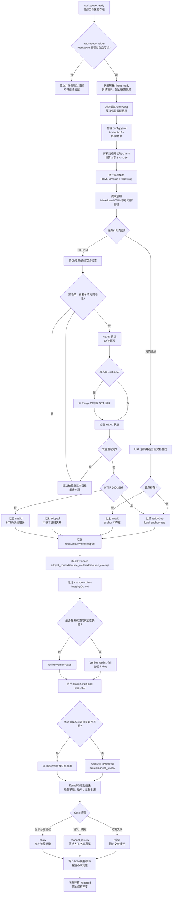

# `validate-md-ref` 状态机与验证器协作调查日记

调查日期：2026-08-27  
任务工作区：`.bensz-api/task-20260827-0708-核查博客参考文献/`  
调查对象：一次真实的 Markdown 参考文献链接核查运行  
目的：记录 AI 如何协调状态机、链接完整性 Verifier、Markdown 适配器和语义复核边界，并据此总结可推广规律。

## 先给结论

这次任务能够完成，是因为四个层次各自承担了清晰的职责：

1. 状态机确认“流程可以开始、正在检查、结果已经报告”。
2. Markdown 适配器读取原文、提取链接并采集逐条事实。
3. `markdown.link-integrity@1.0.0` 将链接事实标准化为 Verifier 结果和 Gate。
4. `citation.truth-and-fit@1.0.0` 明确语义证据不足，留下 `manual_review`，没有把 URL 可达性冒充为引用真实性。

正式报告的结论是：24 条链接中 23 条有效、1 条返回 HTTP 403；站内 `#ref1`–`#ref7` 均可定位。原始 Markdown 未修改。

同时，内部 Kernel 事件中的一次直接 Verifier 结果显示 11 条有效、13 条 skipped。这与正式适配器报告不一致，是本次调查必须保留的运行时口径差异，不能用一个数字掩盖另一个数字。

## 参与组件与职责

| 组件 | 本次职责 | 不负责的事情 |
|---|---|---|
| AI/调用方 | 选择 Skill、复用任务工作区、按契约编排步骤、解释不确定性 | 不手工伪造状态快照或 Verifier 结果 |
| `bsk` 状态机 | 校验并持久化生命周期状态转移 | 不解析 Markdown，不发 HTTP 请求 |
| `validate_links.py` | Markdown 输入适配、引用提取、锚点检查、外链探测、语义证据组装 | 不判断来源是否支持正文论断 |
| `markdown.link-integrity@1.0.0` | 统一执行链接/锚点完整性检查并输出规范结果 | 不做引用语义分析 |
| `citation.truth-and-fit@1.0.0` | 接收标准化语义证据并声明需要人工复核 | 当前没有内置语义引擎 |
| EventLog | 追加验证结果和 Gate，支持审计/重放 | 不自动替调用方做业务决策 |

## AI 的编排顺序（按运行契约展开）

为了避免把“状态检查”和“链接检查”混成一个脚本，调用方应按以下顺序协调命令；路径在实际运行时替换为当前任务根目录和目标文档：

```bash
bsk workspace status TASK_ROOT
bsk state list --skill-root SKILL_ROOT
bsk state describe validate-md-ref.input-ready --skill-root SKILL_ROOT
bsk state transition TASK_ROOT validate-md-ref validate-md-ref.input-ready \
  --skill-root SKILL_ROOT --context-json '{"document":"DOCUMENT.md"}'
bsk state transition TASK_ROOT validate-md-ref validate-md-ref.checking \
  --skill-root SKILL_ROOT --context-json '{"document":"DOCUMENT.md"}'
bsk verifier run markdown.link-integrity --version 1.0.0 \
  --input DOCUMENT.md --events TASK_ROOT/log/events.ndjson --run-id RUN_ID
python3 SKILL_ROOT/scripts/validate_links.py DOCUMENT.md CONFIG.yaml \
  --events TASK_ROOT/log/events.ndjson --run-id RUN_ID --attempt-id ATTEMPT_ID
bsk state transition TASK_ROOT validate-md-ref validate-md-ref.reported \
  --skill-root SKILL_ROOT --context-json '{"document":"DOCUMENT.md"}'
```

这组命令表达的是“先确认状态，再验证，再报告”。AI 的职责是：读取每条命令的标准 JSON 回执；若状态转移、Verifier 执行或事件写入失败，就停止后续流程并报告原因；若得到 `allow`、`reject` 或 `manual_review`，则原样保留其含义，不擅自改成完成或失败。

本次任务的结果文件表明状态快照和 Verifier 结果都已生成；事件账本中也存在 `verification.result` 和 `verification.gate` 记录。由于历史运行包含适配器与 Kernel 两套探测结果，调查日记同时保留两套统计，不把它们强行合并。

## 按时间记录本次运行

### 07:08：锁定任务工作区

任务工作区已有稳定路径：

```text
.bensz-api/task-20260827-0708-核查博客参考文献/
```

`.workspace.json` 记录初始状态为 `workspace.ready`。AI 复用这个既有工作区，没有重新计算时间戳，也没有另建第二个任务根目录。

源 Markdown 只作为外部输入读取，没有复制到任务工作区。工作区保存的是状态、结果、哈希和日志，而不是原文全文。

### 07:09：进入 `input-ready`

状态机的入口条件是 `workspace.ready`。`input-ready` helper 检查：

- 目标路径存在；
- 目标是可读取的 Markdown 文件；
- 输入按只读方式处理；
- 工作区不写入敏感信息。

检查通过后，状态快照写入：

```text
validate-md-ref/log/meta-state.json
```

### 07:09：进入 `checking`

状态机允许的下一跳只有：

```text
validate-md-ref.input-ready → validate-md-ref.checking
```

该状态要求两件事：开始采集链接事实，并保留规范化验证结果。它本身没有 helper 脚本，所以状态快照里的 `not_applicable` 不是验证失败，而是“该状态节点没有独立脚本”的说明。

### 07:09：准备配置和安全边界

默认配置来自 `skills/beta/validate-md-ref/config.yaml`：

- 超时：10 秒；
- 白名单：空，表示不限制公开域名；
- 黑名单：`localhost`、`127.0.0.1`、`0.0.0.0`、`*.local`、`*.internal`。

Kernel 还会在 DNS 解析后拦截回环、私有、链路本地和保留地址，避免通过外链验证访问本机或内网服务。重定向目标也会重新做同样的检查。

### 07:09：读取并指纹化 Markdown

程序把输入路径解析为绝对路径，确认是普通文件，按 UTF-8 读取内容，并计算 SHA-256：

```text
122b6f647a38610ec9b29cf4c4b67c67c4f66160adf2da2583818a2f99ac2bd4
```

哈希用于标识“本次验证究竟针对哪一版内容”，不是为了改写文件。

### 07:09：建立锚点集合

程序从两处收集锚点：

1. HTML 的 `id`/`name` 属性，例如 `<a id="ref1">`；
2. Markdown 标题生成的 slug。标题会去掉 HTML、转小写、删除标点、把空格/连字符规范化，并为重名标题追加 `-1`、`-2`。

### 07:09：提取引用

内置 `markdown.link-integrity` 识别：

```markdown
[文字](URL)
```

和：

```html
<a href="URL">文字</a>
```

Skill 适配器另外支持参考文献定义和脚注定义。每条结果保留索引、类型、文字、URL、行号和完整匹配文本。

本例共发现 24 条引用：

- 11 条是文内 `#ref1`–`#ref7` 的引用出现；
- 13 条是外部 HTTP(S) 链接。

### 07:09：验证站内锚点

对 `#refN` 链接，程序不联网，而是去掉 `#`、URL 解码，再检查名称是否存在于当前文档锚点集合中。

本例 `#ref1`–`#ref7` 均存在，因此站内锚点全部有效，并标记为 `local_anchor: true`。

### 07:09：验证外部 HTTP(S)

对每个外链，程序按以下顺序工作：

1. 检查协议和主机名是否合法；
2. 检查黑名单/白名单；
3. 检查主机名和 DNS 结果是否属于本地、回环、私有、链路本地或保留地址；
4. 先发 `HEAD` 请求，超时上限为 10 秒；
5. 不让底层库无条件跟随重定向，而是由程序逐跳处理；
6. 每一跳重新做安全检查，最多 5 跳；
7. `HEAD` 返回 403 或 405 时，尝试一次带 `Range: bytes=0-0` 的 GET；
8. 200–399 视为可达；
9. 400 及以上记录为无效并保留 HTTP 状态码；
10. 超时、DNS 或连接异常保留具体错误；
11. 被安全策略拦截的地址记为 skipped，不把 skipped 说成失效。

正式适配器报告中，12 个外链返回 200，OpenAI 页面返回 403。因此正式摘要为 23 有效、1 无效、0 跳过。

### 07:09：构造标准化验证请求

Markdown 适配器把采集结果转换成 Kernel 能理解的证据：

- `subject_context`：文档路径、格式和内容快照；
- `source_metadata`：引用列表及其验证结果；
- `source_excerpt`：验证摘要和逐条结果。

请求还带有内容哈希、需求名称和稳定的 `request_id`。Verifier 不需要重新解析 Markdown，也不需要重新执行 URL 请求，只读取已经冻结的事实。

### 07:09：运行链接完整性 Verifier

`markdown.link-integrity@1.0.0` 的入口程序读取标准 JSON 请求，调用 `collect_markdown()`，再把结果包装为：

- `execution_status`：执行是否完成；
- `verdict`：`pass` 或 `fail`；
- `facts`：摘要和逐条引用事实；
- `findings`：未跳过且无效的引用；
- `evidence_refs`：事实来自哪些证据。

如果存在缺失锚点、HTTP 4xx/5xx 或其它未跳过的失败，Verifier 会产生 finding；没有确定性失败时，链接规则返回 `pass`。

### 07:09：保留语义验证缺口

`citation.truth-and-fit@1.0.0` 要求来源身份、正文上下文和来源摘录，用来判断：

- 来源是不是所声称的来源；
- 来源内容是否蕴含正文论断；
- 来源是否适合支撑该论断。

本次 Kernel 没有内置语义引擎，因此该 Verifier 返回 `unchecked`，适配器将 Gate 设为 `manual_review`。这表示“需要人工/外部领域引擎复核”，不是“语义判断通过”。

### 07:09：标准化结果和 Gate

Kernel 会检查结果字段是否属于允许集合，并按保守规则计算 Gate：

- 必需 Verifier `fail`、`error` 或 `timed_out`：`reject`；
- 有 `unchecked` 或 `uncertain`：`manual_review`；
- 全部必需检查通过：`allow`。

Gate 是门禁事实，不是自动修改文件或自动修复链接的命令。

### 07:10：进入 `reported`

状态机允许：

```text
validate-md-ref.checking → validate-md-ref.reported
```

进入该状态前，结果被整理为 JSON 和 Markdown 摘要，明确披露 HTTP 403 和语义 `manual_review`。原文没有被修改。

## Mermaid：完整 step-by-step 流程



图中有两个容易混淆的分支：

- `skipped` 是安全策略或白/黑名单的结果，不等于 `invalid`；
- `manual_review` 是语义证据不足，不等于 `pass` 或 `fail`。

## 为什么本例能完成

本例满足了完整运行的必要条件：

1. 输入文件存在且可读；
2. 状态转移符合声明式契约；
3. 固定版本的链接 Verifier 可发现且有入口程序；
4. URL 请求有超时和安全边界；
5. 即使出现 403，也能把它作为结构化 finding 保存，而不是让程序崩溃；
6. 语义引擎缺失时返回可解释的 `manual_review`，没有猜测；
7. 输出能标准化，状态机可以进入 `reported`；
8. 原始文件保持只读。

换句话说，“完成”指的是检查流程完成并交付了有边界的结果，不是宣称所有链接和所有引用都完美。

## 运行记录中的口径差异

两份结果必须同时记录：

| 位置 | 统计 | 产生方式 |
|---|---:|---|
| `tmp/validate-md-ref/01/validate-md-ref-report.json` | 24 总计、23 有效、1 无效、0 跳过 | Skill 适配器使用 `curl` 和配置进行探测 |
| `.bensz-api/.../validate-md-ref/output/verifier-result.json` | 24 总计、11 有效、0 无效、13 跳过 | Kernel 直接 Verifier 的安全探测结果 |

Kernel 事件把 13 个外部域名记为“本地、回环或内部域名”。代码会在 DNS 解析结果属于私有/内部地址时触发这一原因，但现有事件没有保存具体解析地址，所以不能进一步断言到底是哪一个 DNS 结果触发了跳过。

这说明当前链路存在两个事实来源和两套网络策略。正式对外摘要采用适配器报告；内部事件仍需修复为同一套探测结果或明确标注“安全预检结果”。

## 从本例总结的一般规律

### 状态机适合回答“现在能不能做下一步”

状态机应保存生命周期和入口条件，例如：输入是否就绪、验证是否完成、结果是否已经报告。它不应把 Markdown 解析、HTTP 请求或领域判断硬编码进去。

### Verifier 适合回答“某个可验证断言是否成立”

Verifier 应有稳定 ID、版本、输入证据、统一结果和 Gate。确定性规则与语义判断应分开输出，不能把模型猜测混进链接事实。

### 事实、判断、门禁必须分层

本例的正确分层是：

```text
原文 → 链接事实 → Verifier 结果 → Gate → 生命周期动作
```

任一层都不能越权替代下一层：链接可达不等于语义支持，Gate 也不等于自动修复。

### 不确定性是结果，不是异常

403、超时、被安全策略跳过、语义引擎缺失，都应保留原因和状态。`unchecked`、`uncertain`、`manual_review` 比编造一个布尔答案更可靠。

### 安全检查必须覆盖重定向和 DNS

只检查初始 URL 不够。公开域名可能重定向到内网地址，域名也可能解析到私有 IP，因此每一跳都要重新校验。

### 可重放性依赖证据快照和版本

内容哈希、Verifier 版本、请求 ID、attempt ID、逐条 finding 和事件序号共同构成审计基础。只有一个最终数字不足以解释一次运行。

## 做得好的地方

- **边界清楚：** 原文只读；链接事实、语义判断和状态治理没有混成一个脚本。
- **确定性检查可复核：** 每条引用保留 URL、行号、状态码、重定向和错误原因。
- **安全策略实际生效：** 有超时、黑名单、内网/私有地址拦截和重定向复查。
- **语义没有过度承诺：** instruction-only Verifier 返回 `manual_review`，没有把可达性包装成真实性。
- **版本可追踪：** 使用 `markdown.link-integrity@1.0.0`，结果协议由 Kernel 统一标准化。
- **状态可审计：** `meta-state.json`、事件账本、结果 JSON 和源哈希可以互相核对。
- **失败可局部化：** 单个 403 被记录为 finding，不会抹掉其它 23 条有效事实。

## 做得不好的地方

- **两套探测结果没有合并：** 适配器报告为 23/1，Kernel 事件为 11/13 skipped，读者无法只看一份账本得到唯一统计。
- **运行身份仍不够稳固：** `request_id` 不能只依赖文件名或短哈希；并发、重复运行需要统一 `run_id`、`attempt_id` 和幂等键。
- **Gate 与生命周期没有自动绑定：** `reject` 没有自动转为失败状态，`manual_review` 没有自动进入等待状态，仍依赖调用 AI 正确编排。
- **语义证据不完整：** `source_excerpt` 目前主要是验证摘要，不是来源页面的真实摘录，因此语义 Verifier 只能停在人工复核。
- **证据可能过大：** 适配器会构造完整 Markdown 内容作为 `subject_context`；虽然当前事件不保存全文，但内存和输出边界仍可进一步收紧。
- **协议来源存在重复：** `VERIFIER.md` 和 Python 注册定义都描述 Verifier，缺少自动一致性校验。
- **错误分类仍需统一：** Skill 适配器使用 curl，Kernel 使用 urllib/DNS 安全预检；超时、403、跳过和内部地址应共享一套分类词典。

## 后续优化：按最小必要顺序

### 优先修复结果一致性

让适配器和 Kernel 只保留一个链接事实来源：

1. 由 Kernel 完成链接采集，适配器只加载配置并组织语义证据；或
2. 由适配器完成采集，并把同一份结果原样提交给 Kernel，不再让 Kernel 重探测。

短期建议选第二种，改动较小：明确事件中的 13 个 skipped 是安全预检结果，或者在事件中记录与正式报告相同的逐条事实。

### 统一运行标识和幂等行为

为每次运行显式传入：

- `run_id`：一次完整运行；
- `attempt_id`：同一运行的第几次尝试；
- `request_id`：验证请求；
- 幂等键：防止重试重复追加事件。

文件路径或短哈希可以作为组成部分，但不应是唯一身份。

### 把 Gate 连接到状态机，但保持领域无关

建议只在运行时层定义最小映射：

- `reject`：禁止进入交付状态；
- `manual_review`：进入等待人工/外部引擎状态；
- `allow`：允许进入下一阶段。

具体业务 Skill 仍决定“等待谁批准”和“失败后如何修复”，Kernel 不应硬编码这些业务动作。

### 增加真实来源摘录后再实现语义 Verifier

先补齐来源身份、抓取时间、来源摘录和定位信息，再考虑接入模型或领域引擎。没有证据时继续返回 `manual_review`，不要用模型生成的泛泛摘要替代原文摘录。

### 裁剪证据和增强隐私边界

将完整正文从事件证据中移除，只保留：

- 内容哈希；
- 论断所在行或段落的最小片段；
- 引用元数据；
- 来源摘录哈希和定位。

这样既能重放判断，又不会把不必要的原文写入审计日志。

### 自动检查契约一致性

在测试中比较 `VERIFIER.md`、Python `VerifierSpec`、CLI 输出字段和事件 schema，防止版本、ID、能力标签或不确定性策略漂移。

## 调查依据与关键路径

- Skill 契约：`skills/beta/validate-md-ref/SKILL.md`
- 状态机契约：`skills/beta/validate-md-ref/references/state-machine.md`
- Verifier 契约：`skills/beta/validate-md-ref/references/verifiers.md`
- 输入输出格式：`skills/beta/validate-md-ref/references/formats.md`
- Markdown 适配器：`skills/beta/validate-md-ref/scripts/validate_links.py`
- 链接 Verifier：`packages/bensz-skill-kernel/src/bensz_skill_kernel/verifiers/markdown-link-integrity/`
- 引用语义 Verifier：`packages/bensz-skill-kernel/src/bensz_skill_kernel/verifiers/citation-truth-and-fit/`
- 状态快照：`.bensz-api/task-20260827-0708-核查博客参考文献/validate-md-ref/log/meta-state.json`
- 正式机器报告：`tmp/validate-md-ref/01/validate-md-ref-report.json`
- 正式摘要：`tmp/validate-md-ref/01/审查摘要.md`

## 最终判断

本例证明了一个实用的最小架构：状态机管理流程，Verifier 管理断言，适配器负责格式转换，AI 负责按契约协调并解释边界。

它已经足以完成“链接和锚点是否可达”的检查，但还没有达到“单一事实来源、Gate 自动驱动生命周期、语义引用可自动复核”的完整闭环。后续最值得做的是先消除两套统计口径，再统一运行身份和 Gate 状态映射，最后才是接入更昂贵的语义引擎。

## 后续实现调整（2026-08-27）

根据本调查暴露的模块边界问题，Markdown 专属实现已完成最小迁移：

- 新增 `packages/bensz-skill-kernel/src/bensz_skill_kernel/verifiers/markdown-link-integrity/scripts/collector.py`，承载 Markdown 链接提取、锚点解析、网络安全预检、重定向处理、URL 探测和结果汇总；
- `scripts/verify.py` 只保留 JSON-stdio 入口、参数读取、异常转换和 finding 包装；
- `bensz_skill_kernel.builtins` 保留通用 `artifact.file-exists`、`citation.truth-and-fit` 契约及 Pack 注册；其中旧的 `collect_markdown` 公共导出仅保留一个懒加载兼容代理，不再承载 Markdown 解析实现；
- 删除了未被当前内置注册器使用、且依赖旧 `reference.results` 证据名称的 `_markdown_rule()`，避免旧架构残留继续制造误导；
- 更新 Kernel CLI、公开导出和回归测试，使 Markdown 领域测试直接针对 Verifier 自有 collector。

这次迁移不改变 Verifier 的 JSON 输入输出协议、链接判断规则或安全策略，只调整实现归属；Kernel 仍负责发现、启动、超时、标准化和事件记录。
