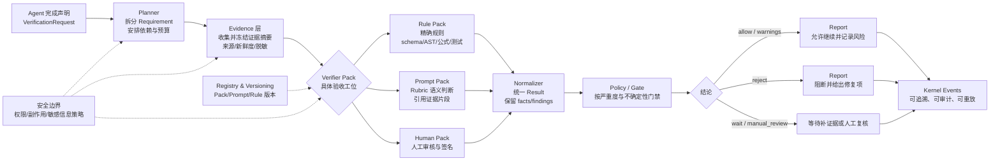
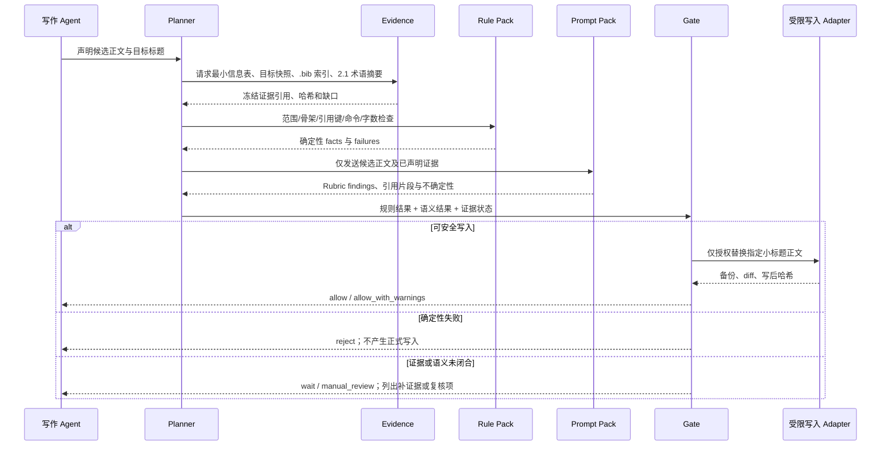

# 通用 Agent Verifiers 基础设施实施计划

## 通俗解释：究竟发生了什么

- **一句话说明：** Agent 经常需要判断“这件事是否真的做对了”，但目前的检查方式散落在提示词、脚本和人工经验中，既难复用，也难说明结论依据。
- **生活类比或具体场景：** 这像一套专业验货服务。验货员可能按尺寸卡尺检查，也可能按照质量标准观察外观；贵重物品还要查看发票并请专家签字。不同物品的检查方法不同，但都需要明确验什么、依据什么、证据在哪里，以及什么情况只能判定为“待复核”。
- **对应到本问题：** 精确规则对应卡尺、秤和检测仪；Prompt/Rubric 对应验货员的判断手册；Evidence Contract 规定验货员必须看到哪些材料；Gate Policy 决定“合格”“不合格”“暂不放行”分别意味着什么。
- **改变前后：** 现在一个 Agent 可能只凭“看起来合理”就声称完成；改进后，它必须调用一个有版本、有输入要求、有判断步骤、有结构化结果和测试样例的 Verifier。能精确证明的由规则完成，只能语义判断的由 Prompt 完成，证据不足时必须保留不确定性。

## 架构总览：一次验证是怎样跑完的

可以把 Verifier 系统理解成一条“验收流水线”，而不是一个神奇的总评模型：

- **入口**接收 Agent 的完成声明，以及“必须满足什么”的 Requirement。
- **Planner** 把大要求拆成几个可检查的小项，并决定先检查什么、哪些检查相互依赖。
- **Evidence 层**只收集这些检查需要的材料，并冻结摘要、来源和新鲜度；没有材料就明确记为“无法核验”。
- **Verifier Pack** 是具体的验收工位：规则型负责精确比对，Prompt 型负责按 Rubric 解释证据，混合型把两者串起来，高风险或机器无法观察的部分交给人工。
- **Normalizer** 把不同工位的结果翻译成统一格式，保留证据片段、版本、置信度和不确定原因。
- **Policy/Gate** 像放行闸机，只根据预先声明的规则决定 `allow`、`reject`、`wait` 或 `manual_review`；它不偷偷替某个领域重新“凭感觉打分”。
- **Report / Kernel Events** 记录“检查了什么、依据是什么、哪里没检查到、为什么放行或拦截”，方便人阅读、审计和重放。



读图时可以抓住一条主线：**先确定要验什么，再准备能证明它的材料，接着用合适的验收工位检查，最后由门禁规则决定是否放行。** 例如“引用是否真的支持这句话”通常会走 `Evidence → Rule（来源身份）→ Prompt（蕴含与范围）→ Gate`；“JSON 是否符合 schema”则可以直接走 `Evidence → Rule → Gate`，不必调用模型。

## 专业判断：问题在哪里

- **当前现象：** 现有计划已经覆盖了 Requirement、Claim、Evidence、VerificationResult 和 Gate，但主要描述“如何收集结果并做门禁”，没有把 Prompt 型语义判断单元定义为一等公民。
- **核心缺口：** “引用是否真实且适当”“论证是否存在跳跃”“证明是否遗漏前提”等任务不能靠一个布尔函数完成；它们需要标准化的判断步骤、证据边界、Rubric、反例处理和不确定性规则。
- **另一类缺口：** 数学证明、schema、权限范围等任务又不能只交给 Prompt。它们需要公式、解析器、定理证明器、AST 或策略引擎等精确验证器。
- **设计结论：** Verifier 不能被定义成“脚本检查器”或“评审 Prompt”中的任一种，而应定义成可组合的判断包。判断包可以是 Prompt 型、规则型、混合型或人工型；统一运行时只负责装载、执行、取证、标准化和门禁。

## 要达到什么目标

### 完成后的变化

- 能注册一个带版本的 Verifier Pack，并明确它判断什么、不判断什么、需要哪些证据、允许哪些工具和副作用。
- Prompt 型 Verifier 具有固定的输入契约、分析步骤、Rubric、输出 Schema、不确定性政策和校准样例，不再是一次性自由发挥的 Prompt。
- 规则型 Verifier 可以执行正则、schema、AST、公式、测试、定理证明器或策略检查。
- 混合型 Verifier 可以先用精确规则收集或筛除事实，再让 Prompt 按固定 Rubric 解释证据；规则结论和语义结论不会被无原则地平均。
- 每个结论都能追溯到输入对象摘要、证据、Verifier/Prompt/规则版本、模型参数、执行环境和门禁策略。
- 证据缺失、工具不可用、模型不确定、外部状态无法确认时，系统不会伪装成 `pass`，而会输出 `unchecked`、`uncertain`、`wait` 或 `manual_review`。

### 不在本次处理范围

- 不建设一个包办所有领域的“超级评审 Prompt”。
- 不把任何单一领域的 Prompt、术语、评分表或专家偏好写死在核心包中。
- 不以模型投票或平均分掩盖高严重度的精确失败。
- 不在首版建设分布式调度、模型训练、reward model 或通用模型网关。
- 不允许 Verifier 借检查名义修改正式产物、发布内容或重放未知副作用。

## 改进方向

### 建立 Verifier Pack 作为核心抽象

一个 Verifier Pack 是可独立注册、加载和测试的判断包，而不是一段孤立 Prompt。它至少包含：

- **目标与能力：** 例如 `citation.entailment`、`proof.obligation_analysis`、`artifact.schema`；
- **输入契约：** 接受哪些 `SubjectRef`，需要哪些上下文和证据；
- **证据契约：** 哪些证据是必需的、允许多新、如何固定摘要、哪些敏感字段必须删除；
- **执行组件：** `PromptPack`、`RulePack`、外部只读探针或人工审核接口；
- **输出契约：** 结构化 finding、证据片段、置信度、不确定原因和修复提示；
- **信任与成本：** 确定性、独立性、模型提供方、成本等级、超时和重试语义；
- **校准资产：** 已知通过、失败、部分支持、证据不足和对抗输入样例。

这意味着新增一个领域能力时，只需新增一个 Pack 和适配器，不需要修改 runner、Gate 或 kernel reducer。

### 标准化 Prompt/Rubric 判断方法

Prompt 型 Verifier 的严谨性来自固定协议，而不只是文字写得更长。每个 `PromptPack` 应包含：

```yaml
prompt_pack:
  version: 1.0.0
  role: 判断者的职责边界
  definitions: 关键术语的操作性定义
  allowed_evidence: 可使用的证据类型
  procedure: 固定分析步骤
  rubric: 各结论等级和反例条件
  uncertainty_policy: 证据不足时的输出规则
  output_schema: 机器可解析的结果结构
  calibration_examples: 已标注样例
```

Prompt 必须要求模型区分“证据中明确出现的内容”和“根据常识推测的内容”，必须引用证据片段，不能因为缺少全文、工具超时或自身感觉合理就判定通过。

复杂判断应优先拆成多个小 Prompt，再由编排器串联。例如一个“引用真实性及适当性” Pack 可以拆为：主张抽取、来源身份核验、证据蕴含判断、引用范围判断、过度外推检测和结果综合。这样每一步都有独立证据和失败位置。

### 统一精确规则与模糊判断的融合语义

核心支持四种 Verifier 模式：

| 模式 | 组成 | 适用场景 |
|---|---|---|
| `rule` | 规则或可执行引擎 | schema、AST、公式、权限、测试、文件范围 |
| `prompt` | Prompt + Rubric + Evidence | 论证质量、适当性、概念判断、反例分析 |
| `hybrid` | 规则、证据采集和 Prompt 组合 | 引用核验、代码审查、证明分析、外部状态核对 |
| `human` | 人工审核表和签名 | 高风险决策、机器无法观察的价值判断 |

混合执行遵循以下顺序：

1. 先冻结对象摘要和证据范围；
2. 先执行廉价、确定性的前置规则；
3. 收集 Prompt 所需的最小证据；
4. 按固定 Rubric 执行语义判断；
5. 保留规则与 Prompt 的独立结论；
6. 由 Policy 根据严重度、信任和不确定性计算门禁。

规则可以对 Prompt 结果形成硬约束。例如 DOI 格式错误可以直接失败；来源无法访问不能直接判定文献不存在；自然语言判断“可能支持”不能覆盖形式化证明器的失败。

### 设计证据、结果和门禁协议

保留当前计划的通用协议，但补充 Prompt 和规则的来源字段：

- `VerifierSpec`：增加 `mode`、`prompt_pack_ref`、`rule_pack_ref`、`evidence_requirements`、`calibration_set_ref`；
- `Evidence`：增加 `source_type`、`excerpt_hash`、`collection_method`、`freshness` 和脱敏摘要；
- `VerificationResult`：区分 `execution_status` 与 `verdict`，并记录 `facts`、`finding`、`evidence_refs`、`confidence`、`uncertainty_reason`、`model_or_engine`；
- `GateDecision`：只负责 `allow`、`allow_with_warnings`、`reject`、`wait`、`manual_review`，不重新解释领域语义。

一个 Prompt 判断即使输出 `pass`，如果没有满足 Evidence Contract，也只能被标准化为 `unchecked` 或 `manual_review`。

### 建立可插拔的运行时边界

建议的核心包职责为：

- `contracts`：Subject、Requirement、Claim、Evidence、Spec、Result、Gate；
- `packs`：Verifier Pack、Prompt Pack、Rule Pack 的加载和版本解析；
- `evidence`：对象摘要、证据采集、脱敏、新鲜度、失效和缓存；
- `planner`：依赖 DAG、前置规则、按需 Prompt、预算和早停；
- `executors`：pure、command、probe、model、human 适配器；
- `normalizer`：把不同 Prompt、规则和引擎输出转换为统一 Result；
- `policy`：信任、冲突、不确定性、重试和门禁；
- `reporting`：结构化报告、人类摘要和可重放记录；
- `adapters/kernel`：可选地追加生命周期事件，不让核心依赖 kernel。

Prompt Pack 只能读取声明的输入和证据，不能修改全局 Policy、改变 Verification Plan 或自行写入正式产物。

### 用两个通用示例验证抽象没有偏科

首版使用领域无关的接口，但准备两个代表性 Pack 作为验收样例：

- **证据型语义判断：** 由证据采集器固定来源，再由多个 Prompt 按 Rubric 判断主张是否被支持、是否存在范围扩大和证据缺口；重点测试 `supported`、`partially_supported`、`contradicted`、`unavailable` 的区别。
- **数学证明型混合判断：** Prompt 负责拆解证明目标、识别隐含前提和生成证明义务；定理证明器或符号引擎负责确认形式正确性；两者冲突时，形式化失败不能被自然语言“看起来合理”覆盖。

这两个示例只验证接口和运行语义，不把任何领域规则放入核心。

## 端到端示例：支持 `nsfc-justification-writer` 的立项依据 Verifier

这一节把抽象的 Verifier 流水线落到一个真实 Skill 上。`nsfc-justification-writer` 的工作不是判断某个课题“能否获资助”，而是受限地生成或修改 NSFC 标书的 `（一）立项依据`：写清价值与必要性、现状不足、科学问题/假说和项目切入点，同时不得破坏 LaTeX 模板或编造不可核验的引用。相应的 Verifier 也只核验这个**交付契约是否被满足**，不替评审专家评价课题价值，更不把模型的主观偏好伪装成科研事实。

可以把它想成一次只允许动一页、且要核对参考文献和论证线索的修订：系统先确认编辑者拿的是正确的一页和正确的资料，再检查改动有没有越界，最后才判断这页文字是否具备应有的论证闭环。没有信息表、文献条目或后续研究内容时，系统会明确说“还不能核验什么”，而不会猜测并放行。

### 这个 Pack 的边界与请求

建议把该领域 Pack 注册为 `nsfc.justification.v1`，其能力声明为 `nsfc.justification.contract`、`nsfc.justification.logic`、`nsfc.justification.citation` 和 `nsfc.justification.consistency`。它是 `hybrid` Pack：确定性规则先保护文件、引用和可观测格式；Prompt/Rubric 只在已冻结的文本和资料范围内判断论证关系；必要时将无法由机器判断的内容升级给人工。

一次典型请求不把整个标书目录和用户环境直接交给模型，而是形成以下脱敏、可寻址的对象快照：

| 对象 | 用途 | Verifier 可见的最小材料 | 不应获得的权限 |
|---|---|---|---|
| `subject` | 待修改的立项依据 | `extraTex/1.1.立项依据.tex` 的正文、四级标题骨架、内容哈希 | 写入 `main.tex`、`extraTex/@config.tex`、`.cls`、`.sty` 或其他文件 |
| `proposal_context` | 判断内容是否有依据 | 填写后的最小信息表中研究对象、痛点、科学问题、假说、切入点；每个字段的存在状态 | 从缺失字段推断研究事实或凭空补全 DOI |
| `related_context` | 检查衔接而非重写后文 | `extraTex/2.1.研究内容.tex` 的术语/缩写摘要及哈希 | 改写研究内容或把全文发送给不需要它的 Pack |
| `bibliography` | 核验引用可追溯性 | `references/**/*.bib` 的 cite key、题录标识、DOI/链接存在状态及哈希 | 访问未声明的网页、以检索结果自动补引文 |
| `candidate_change` | 检查 Agent 拟写入的内容 | 目标 `\subsubsection{...}`、候选正文、字数和候选 `\cite{...}` | 直接执行写入；写入须由受限 adapter 在 Gate 放行后执行 |
| `runtime_context` | 保证结论可复现 | Skill/Pack/config 版本、`style.mode`、模型和参数、时间戳 | 读取 API Key、Cookie、完整本地路径或其他敏感环境变量 |

`Evidence Contract` 应把上述对象以“来源、摘录、哈希、采集时间、脱敏状态、用途”冻结。例如，Prompt 得到的是“信息表的第 3 项科学问题 + 候选段落第 42–87 行 + 2.1 的术语摘要”，而不是可自由遍历的项目目录。引用的身份核验也只证明 cite key 是否在本地 `.bib` 中、是否带可核验标识；它不能据此声称论文全文一定支持候选句子。

### 需求如何拆成可检查项

Planner 把“安全写好立项依据”拆为原子 Requirement。下表同时展示了为什么有些项目由规则硬判、有些项目只能要求模型按 Rubric 给出可复核理由。

| Requirement | Verifier 类型与证据 | 通过条件 | 失败后的标准化结论 |
|---|---|---|---|
| 写入范围受限 | `rule`；写前/写后文件清单与哈希、guardrails | 仅 `extraTex/1.1.立项依据.tex` 发生预期变更 | `fail` / `reject`；不调用写入 adapter |
| 保留既有小标题骨架 | `rule`；候选前后的 `\subsubsection` 序列 | 标题及顺序不变，只替换选定标题正文 | `fail` / `reject` |
| 引用键可解析 | `rule`；候选 `\cite{key}` 与 `.bib` key 集合 | 每个 key 都存在；若要写入则不能依赖“稍后再补”的条目 | `fail` / `reject`，返回缺失 key |
| 禁止危险 LaTeX 命令 | `rule`；候选正文与 `avoid_commands` | 不含 `\section`、`\subsection`、`\input`、`\include` 等越界命令 | `fail` / `reject` |
| 最小信息表足以支撑写作 | `rule`；必填字段存在性与字段哈希 | 研究对象、痛点、科学问题、假说、切入点均已给出 | `unchecked` / `wait`，指出应补的字段而非替用户臆造 |
| 四段论证闭环 | `prompt` + 回退启发式；正文、标题、信息表 | 可在证据中定位价值/必要性、现状不足、科学问题/假说、切入点/过渡四个维度 | `uncertain` / `manual_review`；返回缺维和证据片段 |
| 科学问题、假说不是工程任务句 | `prompt`；信息表与候选句的逐句对照 | 问题是可回答的认知缺口，假说是可证伪的预测，不把“开发/实现/验证方式”伪装成二者 | `fail` 或 `manual_review`，保留具体句子和判断理由 |
| 术语与 `2.1` 一致 | `hybrid`；别名表、缩写摘要、候选文本 | 未出现未经解释的同义漂移或相互冲突的研究对象/指标 | `uncertain` / `manual_review`；不得自动改写后续章节 |
| 不作不可核验的夸张宣称 | `hybrid`；高风险词命中、候选句、引用状态 | 不含无证据支撑的“国际领先”“国内首次”等结论；不能仅靠改同义词绕过 | `fail` / `manual_review`，标出原句与需要的可核验依据 |
| 篇幅符合本次要求 | `rule`；去注释后的中文字符数、用户要求和配置 | 有用户明确目标时按其范围；无明确目标时按配置给出诊断 | 通常 `warning`，不因默认篇幅建议单独阻断安全写入 |

这里的“失败”并不都等价于“内容差”。缺失信息表或 AI 不可用属于**无法观察**，应产生 `unchecked`/`wait`/`manual_review`；引用 key 不存在或越权修改属于**确定性反例**，应直接 `reject`。这种区分让 Agent 获得可行动的反馈：前者是补材料或请人复核，后者是先撤销候选改动。

### Pack、Prompt 与 Gate 的最小契约

下面的伪配置刻意展示运行时接口，而不是建议把 NSFC 术语写进核心包。实际 Prompt 文本、Rubric 和校准集都随 Pack 版本发布，核心只读取声明并执行它。

```yaml
verifier_id: nsfc.justification.v1
version: 1.0.0
mode: hybrid
subject_selector:
  allowed_write_files: [extraTex/1.1.立项依据.tex]
  preserve_subsubsection_skeleton: true
evidence_requirements:
  required:
    - justification_tex_snapshot
    - candidate_section_body
    - filled_info_form_fields
    - bibliography_key_index
  optional:
    - research_content_terminology_summary
    - literature_review_snapshot
rules:
  - id: write-scope
    severity: required
  - id: citation-key-exists
    severity: required
  - id: forbidden-latex-command
    severity: required
  - id: word-count-diagnostic
    severity: advisory
prompts:
  - id: justification-logic-rubric
    requires: [candidate_section_body, filled_info_form_fields]
  - id: question-hypothesis-rubric
    requires: [candidate_section_body, filled_info_form_fields]
  - id: terminology-consistency-rubric
    requires: [candidate_section_body, research_content_terminology_summary]
uncertainty_policy:
  missing_required_evidence: wait
  model_unavailable: manual_review
  invalid_prompt_output: unchecked
  deterministic_required_failure: reject
gate_policy:
  apply_requires:
    - all_required_rules_pass
    - no_required_semantic_failure
    - no_unresolved_required_uncertainty
  advisory_findings: allow_with_warnings
post_apply_verification: [write-scope, skeleton-preserved, target-hash-recorded]
```

其中 Prompt 不是“请评审这段文字”的自由问答，而是一个受证据约束的判断单元。例如 `question-hypothesis-rubric` 应依次：识别候选中的科学问题句与假说句；逐句引用信息表或正文片段；按“认知缺口/可证伪预测/未混入研究目标或验证方式”打标签；寻找至少一个反例；最后输出固定 JSON。输出至少含 `verdict`、`findings[]`、`evidence_refs[]`、`confidence`、`uncertainty_reason` 和 `repair_hint`。缺少信息表第 3 或第 4 项时，它只能回答“无法核验”，绝不能根据课题名称猜出科学问题或假说。

### 一次实际运行会看见什么

下面以 Agent 声明“已把‘国内外研究现状’正文改好，准备写入”为例。示例中的题目和 cite key 均为占位符，不构成科研结论或可用参考文献。



一个足以体现差异的结果报告可以是：规则发现候选中 `\cite{placeholder2026}` 不在本地 `.bib`，且正文含有“国际领先”；同时 Prompt 虽认为四段框架大致齐全，但无法把“国际领先”映射到任何可核验来源。Normalizer 应保留三条独立 finding，而不是把它们平均成一个 78 分：

```yaml
execution_status: completed
verdict: fail
gate_decision: reject
findings:
  - id: citation-key-exists
    kind: deterministic
    severity: required
    verdict: fail
    evidence_refs: [candidate:cite:placeholder2026, bib:index:sha256:...]
    repair_hint: "补入可核验题录，或删除该引用；不得用占位 key 写入。"
  - id: boastful-expression
    kind: hybrid
    severity: required
    verdict: fail
    evidence_refs: [candidate:sentence:12, prompt:rubric:boastful-v1]
    repair_hint: "删除绝对化结论，或改为可由所列证据直接支持的事实性表述。"
  - id: justification-logic-rubric
    kind: semantic
    severity: required
    verdict: pass
    confidence: 0.82
    evidence_refs: [candidate:sections:1-4, info_form:fields:1-5]
```

`gate_decision` 仍应为 `reject`：两个 required 的确定性/可定位失败不能被一项语义通过抵消。相反，如果所有规则通过但运行环境没有可用模型，系统应执行已有硬编码回退，生成结构、字数、引用与术语的诊断；语义项记录为 `unchecked`，对 `preview` 返回带缺口的报告，对 `apply` 返回 `manual_review`，而不是停工或虚报 `pass`。人工确认后也必须把确认人、所见证据版本、时间和理由记录为独立 Human Result，不能覆盖原有的 `unchecked`。

### 写后核验、修复循环与校准样例

该 Pack 的安全性不止在写前。Gate 放行后，唯一具备写权限的 adapter 调用现有的“按 `\subsubsection{...}` 精确替换正文并备份”能力；随后重新取证，确认目标哈希变化、其他受保护文件哈希未变、标题骨架未变，并保存 backup、diff、Pack/Prompt/规则版本和 Gate 原因。写后核验失败时，结论为 `error`/`wait`，不得假定写入成功；恢复必须使用已记录 backup 的显式 rollback 流程。

首版校准集不需要真实标书或隐私数据，可使用脱敏、最小化 fixture 覆盖以下情形：

- 完整信息表、有效 cite key、四段闭环，得到 `allow`；
- 改动 `main.tex` 或插入 `\input`，在模型调用前 `reject`；
- 引用 key 缺失，稳定返回缺失 key 且不写入；
- 科学问题写成“构建某系统”、假说写成“通过某验证”，Prompt 必须给出定位和改写方向；
- 只写背景和方法、缺少科学问题/假说，得到可解释的 `manual_review`；
- 与 `2.1` 的研究对象或指标冲突，保留双方摘要并升级复核，不自动选择一方覆盖另一方；
- 模型超时或返回不符合 Schema，硬编码检查仍完整运行，语义结论为 `unchecked`；
- 写后哈希显示受保护文件变动，阻断完成声明并给出恢复证据。

这个实例最终证明的是通用基础设施是否能承载一个真实、带写入风险的领域 Skill：核心运行时没有 NSFC 特判，领域 Pack 则能精确表达 NSFC 的输入表、文件白名单、四段逻辑、引用边界和人工升级策略。后续新增其他写作或代码 Skill 时，应复用同一套 `Subject → Evidence → Result → Gate` 协议，而不是复制这套具体规则。

## 实施范围与顺序

1. **冻结 Verifier Pack 契约。** 明确 `prompt`、`rule`、`hybrid`、`human` 四种模式，固定输入、证据、输出、版本、不确定性和副作用字段，并提供最小 JSON Schema。
2. **实现离线运行时。** 完成 contracts、Pack registry、evidence snapshot、planner、runner、normalizer 和 policy；不接真实模型、不接网络时也能用 fake Prompt provider 和 fake Rule engine 端到端运行。
3. **实现 Prompt Pack 执行协议。** 支持多步 Prompt DAG、固定 Rubric、结构化输出、证据片段引用、模型参数记录、超时和降级；模型不可用时输出明确的 `unchecked`，不能默认为通过。
4. **实现 Rule Pack 与混合编排。** 支持纯函数、隔离命令、schema/AST/公式引擎和只读探针；定义硬失败、软警告、证据缺失和语义不确定之间的合并规则。
5. **加入通用参考 Pack 与首个领域试点。** 先用证据型语义判断和数学证明型混合判断验证核心接口，再以 `nsfc.justification.v1` 验证写入白名单、信息表、引用、四段逻辑、术语衔接、写后核验和人工升级如何作为独立领域 Pack 组合；每个 Pack 都提供正例、负例、边界例、对抗输入和预期 GateDecision。
6. **接入 kernel 适配器。** 将验证开始、单项结果、门禁、等待、外部核对和人工审核映射为追加式事件，并验证从事件和证据可以重建验证事实。
7. **开放领域插件接口。** 在核心协议稳定、重放和安全测试通过后，再允许科研、代码、文档、部署等领域提供自己的 Prompt/Rubric/Rule Pack。

## 如何确认完成

### 协议与组合

- 新增一个 Prompt Pack 或 Rule Pack 不需要修改 runner、Gate 或 kernel reducer。
- 同一个 `VerificationRequest` 可以混合运行 Prompt、规则和人工组件。
- 所有组件都能报告证据引用、版本、执行状态和不确定原因。

### Prompt 型能力

- Prompt Pack 有固定的输入契约、分析步骤、Rubric、输出 Schema 和校准样例。
- 缺少必需证据、证据过期、模型超时或输出不符合 Schema 时，不能得到 `pass`。
- 语义判断必须保留证据片段和原子 finding，不得只输出总分。

### 精确型能力

- schema、AST、公式、命令和证明引擎的失败可以稳定重放。
- 规则结果和 Prompt 结果分别保留；高严重度确定性失败不会被语义通过抵消。
- 隔离命令、外部 probe 和模型适配器不能绕过权限、敏感度和网络策略。

### 门禁与安全

- `pass`、`fail`、`uncertain`、`unchecked`、`error`、`timed_out` 和 `skipped` 语义互不混淆。
- required 失败能阻断，optional 失败只能按策略告警，无法观察的要求进入 `manual_review` 或显式 verification gap。
- 输入文档、网页、日志和模型返回内容不能改变 Verifier 的规则、权限或路由。
- 外部副作用结果未知时只能 reconciliation 或等待，不能自动重放写操作。

### 可维护性与质量

- 每个 Pack 都有版本变更记录和脱敏校准集。
- 报告能够回答：验证了什么、使用了什么证据、哪些部分没有验证、为什么放行、还剩什么风险。
- 至少覆盖：完全通过、确定性失败、Prompt 不确定、证据不足、规则与 Prompt 冲突、工具超时、模型不可用和人工复核八类测试。
- `nsfc.justification.v1` 的脱敏校准集还覆盖越权文件修改、缺失 bibkey、信息表缺项、科学问题/假说口径错误、与 `2.1` 术语冲突及写后保护文件哈希异常；这些场景均可在不访问真实标书的条件下重放。

## 技术补充：建议的数据结构

```yaml
verifier_id: citation-truth-and-fit
version: 1.0.0
mode: hybrid
capabilities:
  - evidence.identity
  - semantic.entailment
  - semantic.appropriateness
prompt_pack_ref: packs/citation-truth-and-fit/prompts/v1
rule_pack_ref: packs/citation-truth-and-fit/rules/v1
evidence_requirements:
  - subject_context
  - source_metadata
  - source_excerpt
uncertainty_policy:
  missing_source_excerpt: manual_review
  provider_timeout: unchecked
  deterministic_identity_failure: fail
```

该结构只是公开接口示例，不代表核心包内置任何具体领域 Prompt。领域知识应通过 Pack 注入，核心只保证其执行边界、证据可追溯性和门禁语义。

## 风险与待确认事项

- **Prompt 的可重复性：** 同一输入不一定得到逐字相同的模型回答，因此必须记录模型、参数、Prompt 版本、输入摘要和结构化结果；“可重放”应理解为可追溯和可比较，而不是绝对字节相同。
- **语义判断的真实边界：** Prompt 只能解释提供的证据，不能凭空创造事实。来源身份、全文获取和外部状态需要独立的 Evidence Adapter。
- **规则与语义冲突：** 首版必须明确确定性反例的优先级、语义不确定的处理方式和人工升级条件，不能交给“综合评分”隐式决定。
- **校准数据质量：** Prompt Verifier 的质量取决于边界案例和人工标注；应先建立少量高质量样例，再扩充规模。
- **安全边界：** Prompt、外部网页和插件输出都视为不可信输入，不能改变 Policy、权限或副作用范围。
- **核心范围控制：** 领域 Pack 可以快速增加，但核心协议和运行时不得因为某个领域出现特殊分支；否则最终会重新退化为一组互不兼容的专用检查脚本。
