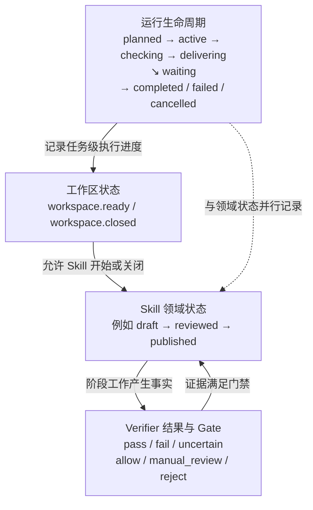
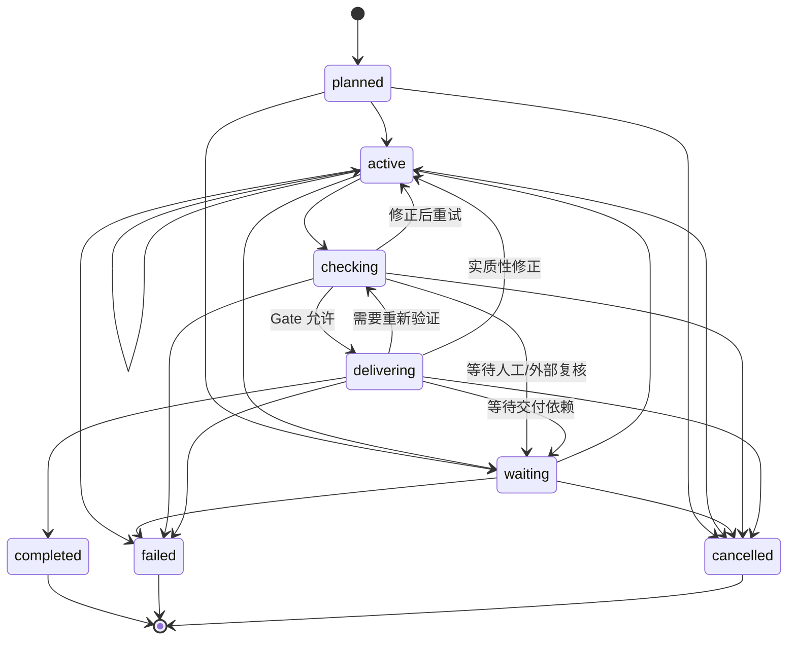
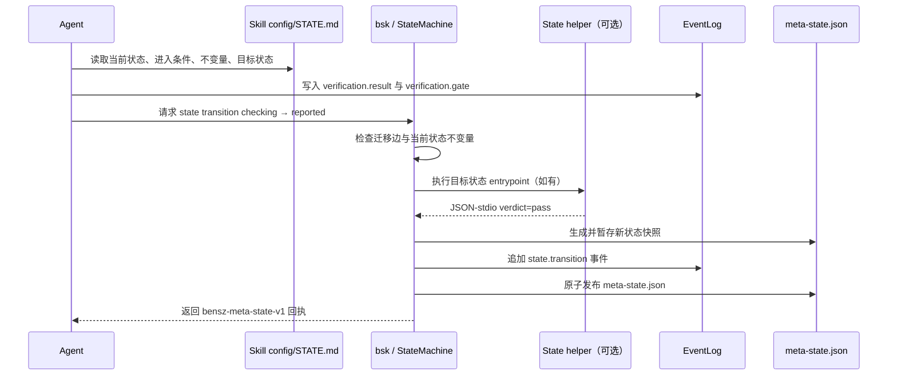

# Bensz Skill 状态机直观教程

这篇教程回答一个实际使用时经常出现的问题：**状态机到底是什么，AI 在什么时候读取它、什么时候改变它，Kernel 又负责了什么？**

可以先记住一句话：

> 状态机是任务进度的可审计“交通规则”。它规定当前阶段是什么、下一步允许去哪儿，以及离开当前阶段前必须留下哪些证据；它不是替 AI 完成工作的脚本引擎。

## 先看全貌

一次 Skill 执行通常同时有三层状态。它们有关联，但不是同一个状态机：



三个层次的职责是：

- **工作区状态**：任务根目录是否已经锁定、是否还允许写入中间产物。
- **运行生命周期**：这次任务整体是在准备、执行、等待、检查、交付，还是已经结束。
- **Skill 领域状态**：这个 Skill 自己的业务阶段，例如“输入已就绪”“草稿已生成”“报告已提交”。

Verifier 是证据检查器，不是状态。它的结果可能决定某条迁移能不能发生，但不会替代领域状态。

## 用一个比喻理解“状态”和“迁移”

把一次 Skill 执行想成机场登机：

| 状态机概念 | 机场中的对应物 |
| --- | --- |
| 状态（state） | 旅客目前处于“已值机”“安检中”或“已登机” |
| 迁移（transition） | 从一个阶段进入另一个阶段的请求 |
| 进入条件（entry conditions） | 进入安检区前必须已经值机 |
| 不变量（invariants） | 离开安检区前必须完成安全检查 |
| 事件（event） | 值机完成、检查结果、登机记录等不可变事实 |
| 快照（snapshot） | 当前状态的便于读取的投影，不是唯一事实来源 |
| 终态（terminal state） | 本次旅程完成、失败或取消，不能原地继续改写 |

因此，AI 不能只说“我已经完成了检查”，然后直接把状态改成 `reported`。它必须先运行约定的检查器，把结果和 Gate 写入事件账本；Kernel 再根据状态契约判断这条迁移是否合法。

## 内置生命周期状态能表达什么

Kernel 内置的通用生命周期状态位于 [`packages/bensz-skill-kernel/src/bensz_skill_kernel/states/`](../packages/bensz-skill-kernel/src/bensz_skill_kernel/states/)，索引见 [`states/index.json`](../packages/bensz-skill-kernel/src/bensz_skill_kernel/states/index.json)：



这些状态只描述**执行治理**，不描述某个领域的具体动作。比如，文献核查、提示词转换、NSFC 写作都可以使用 `checking`，但每个 Skill 对“检查什么”有自己的契约。

`waiting` 也不是失败。等待原因放在正交字段 `wait_reason` 中，例如 `input`、`approval`、`dependency`、`quota` 或 `operator_pause`。这样不需要为每一种等待原因增加一个新状态。

## Skill 状态如何叠加在生命周期之上

领域状态由 Skill 自己托管，通常放在 `references/states/<state>/STATE.md`，并在 Skill 的 `config.yaml` 中声明。例如，一个接入了领域状态 Pack 的 Skill 可以声明：

```text
bensz.workspace.ready
  → bensz.example.review.draft
  → bensz.example.review.checking
  → bensz.example.review.reviewed
  → bensz.example.review.published
  → bensz.workspace.closed
```

这条链描述的是 Prompt Program 的业务阶段；任务级运行状态仍可以同时处于 `active`、`checking` 或 `delivering`。事件 reducer 会把 Skill 状态放到 `skill_states` 和 `skill_state_transitions`，不会把它误当成 Kernel 的八个生命周期状态。

领域状态的典型契约如下：

```yaml
id: bensz.example.review.reviewed
version: 1.0.0
kind: skill
entry_conditions: bensz.example.review.checking
invariants: verifier-result-recorded, required-verifiers-pass
transitions: bensz.example.review.reported
```

正文再用自然语言告诉 AI：这一阶段已经成立什么事实、应该执行什么工作、需要保留什么证据，以及什么情况下只能等待或失败。`STATE.md` 的完整阶段模板见仓库的 [`AGENTS.md`](../AGENTS.md) 和现有示例 [`validate-md-ref` 状态契约](../skills/beta/validate-md-ref/references/states/checking/STATE.md)。

## AI 实际执行一次迁移时发生什么

以从 `checking` 进入 `reported` 为例，AI 的操作顺序可以画成：



如果没有 `entrypoint`，Kernel 不会猜测或自动执行 `STATE.md` 正文，而是返回 `unchecked`，由 AI 按契约完成 instruction-only 工作。只有显式 helper 成功返回 `verdict=pass`，才会允许该 helper 门禁的迁移落盘。

常用命令如下：

```bash
# 查看内置状态和 Skill 状态
bsk state list --skill-root path/to/skill

# 查看一个状态的完整契约
bsk state describe bensz.example.review.checking --skill-root path/to/skill

# 只检查迁移是否在图中允许
bsk state check \
  bensz.example.review.checking \
  bensz.example.review.reported \
  --skill-root path/to/skill

# 在任务工作区中执行并持久化迁移
bsk state transition .bensz-api/task-YYYYMMDD-HHMM-demo review \
  bensz.example.review.reported \
  --skill-root path/to/skill \
  --run-id RUN_ID --attempt-id ATTEMPT_ID \
  --context-json '{"report":"report.md"}'
```

迁移成功后会同时得到两种记录：

- Skill 级快照：`<skill>/log/meta-state.json`，方便快速读取当前领域状态；
- 任务级事件：`log/events.ndjson`，作为可重放、可审计的事实来源。

快照不是让 AI 手写的结果。Kernel 会绑定状态版本、事件 ID 和稳定字段哈希；`bsk rebuild` 可以根据事件重建投影，并检查快照是否漂移。

## Verifier 为什么会影响状态迁移

Verifier 负责回答“某个事实是否满足检查要求”，例如：

- 结构是否符合契约；
- 文件是否存在且在允许路径内；
- Markdown 链接是否完整；
- 必需 Verifier 是否全部通过；
- Gate 是否允许继续交付。

它通常产生两类事件：

```text
verification.result  # 某个 Verifier 的标准化结果
verification.gate    # Kernel 对一批结果计算出的门禁决定
```

如果当前状态声明了 `verifier-result-recorded`，离开该状态前缺少上述任一事件，迁移会被拒绝。如果声明了 `required-verifiers-pass`，则必须有同一 `run_id`/`attempt_id` 下全部 required Verifier 的 `completed + pass` 结果，且 allowing Gate 覆盖这些结果。

注意：`uncertain`、`unchecked` 和执行错误都不能被 AI 擅自改写成 `pass`。正确路径通常是回到 `active` 修正、进入 `waiting` 等待复核，或进入 `failed` 保留失败证据。

## Kernel 代码分别支持什么

下面这张表按“AI 会感知到的能力”对应到实现文件。它也说明了哪些事情 Kernel 做、哪些事情仍由 Skill/Agent 做。

| 代码位置 | 支持的功能 | AI/Skill 如何使用 |
| --- | --- | --- |
| [`states/index.json`](../packages/bensz-skill-kernel/src/bensz_skill_kernel/states/index.json) | 内置 State Pack 的目录、canonical ID、版本、alias、分类和标签 | 注册表据此发现和校验内置状态；不要把索引外的目录当成已注册状态 |
| [`states.py`](../packages/bensz-skill-kernel/src/bensz_skill_kernel/states.py) | 解析 `STATE.md`、注册表、Skill 状态声明、迁移检查、invariant 检查、可选 helper 执行 | `bsk state list/describe/check/execute/transition` 的主要实现；Skill 通过 `config.yaml.runtime` 声明状态集合 |
| [`state_ids.py`](../packages/bensz-skill-kernel/src/bensz_skill_kernel/state_ids.py) | 校验 `owner.machine.state` canonical ID，解析 legacy alias | 新状态使用 canonical ID；重命名用 alias 兼容旧事件和旧配置 |
| [`runtime.py`](../packages/bensz-skill-kernel/src/bensz_skill_kernel/runtime.py) | 任务生命周期 reducer、事件账本、状态投影、完成门禁、事件回放 | 记录 `task.started`、`validation.started`、`delivery.started` 等任务级事实；`bsk rebuild` 从事件重建状态 |
| [`workspace.py`](../packages/bensz-skill-kernel/src/bensz_skill_kernel/workspace.py) | 创建并锁定 `.bensz-api/task-*`，解析 Skill 的 `input/output/log` 边界，生成和校验元状态快照 | 先初始化工作区，再让 Skill 通过标准路径读写中间产物；正式交付物仍在项目路径 |
| [`packs.py`](../packages/bensz-skill-kernel/src/bensz_skill_kernel/packs.py) | State/Verifier Pack 的索引发现、目录安全检查、入口路径约束、JSON-stdio、超时和输出限制 | 为两类 Pack 提供共同的存储和进程边界，但不决定领域语义 |
| [`verifiers.py`](../packages/bensz-skill-kernel/src/bensz_skill_kernel/verifiers.py) | Verifier 注册、请求/证据归一化、结果记录、Gate 计算和版本解析 | Skill 声明 required/advisory Verifier；Agent 根据标准结果决定修正、等待或继续 |
| [`atomic_verifiers.py`](../packages/bensz-skill-kernel/src/bensz_skill_kernel/atomic_verifiers.py) | 通用原子检查，如路径范围、Schema、事件完整性、状态转移、敏感信息和任务完整性 | 只接收通用事实；领域判断仍放在 Skill 自己的 Verifier 或人工复核中 |
| [`contracts.py`](../packages/bensz-skill-kernel/src/bensz_skill_kernel/contracts.py) | `Subject`、`Requirement`、`Artifact`、`Effect`、`Authorization`、`Contract` 等交接对象 | Skill/Adapter 用统一形状传递输入、产物、授权和副作用状态，避免各自发明字段 |
| [`cli.py`](../packages/bensz-skill-kernel/src/bensz_skill_kernel/cli.py) | `bsk state`、`workspace`、`verification`、`artifact`、`delivery` 等公开命令 | Agent 通常调用 CLI 获取结构化 JSON 回执，而不是直接编辑事件或快照文件 |
| [`__init__.py`](../packages/bensz-skill-kernel/src/bensz_skill_kernel/__init__.py) | 汇总公开 Python API | Python Adapter 可以从此处导入注册表、状态机、工作区和运行时对象 |

## 一个最小但完整的心智模型

执行一个 Skill 时，可以按下面的问句逐步判断：

1. **我现在在哪一层？** 是工作区、任务生命周期，还是 Skill 领域阶段？
2. **当前状态已经证明了什么？** 只相信契约和事件，不相信没有证据的口头描述。
3. **我准备去哪儿？** 目标状态必须在当前状态的 `transitions` 中，或满足受控的 wildcard 入口条件。
4. **离开前缺什么？** 检查 entry conditions、Kernel invariant、required Verifier、产物和人工决策。
5. **这个动作会留下什么？** 把验证结果、产物引用、授权和迁移事件写入标准账本。
6. **如果失败怎么办？** 保留失败证据；可恢复问题进入 `active`/`waiting`，不可恢复问题进入 `failed`，不要伪造成功状态。

最后，状态机的价值不是让每个 Skill 都拥有很多状态，而是让不同 Skill 用同一套方式回答：**当前阶段是什么、下一步是否允许、凭什么允许、失败后如何恢复，以及事后如何重放。**
