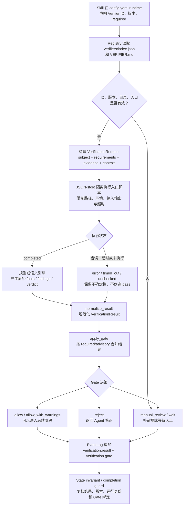
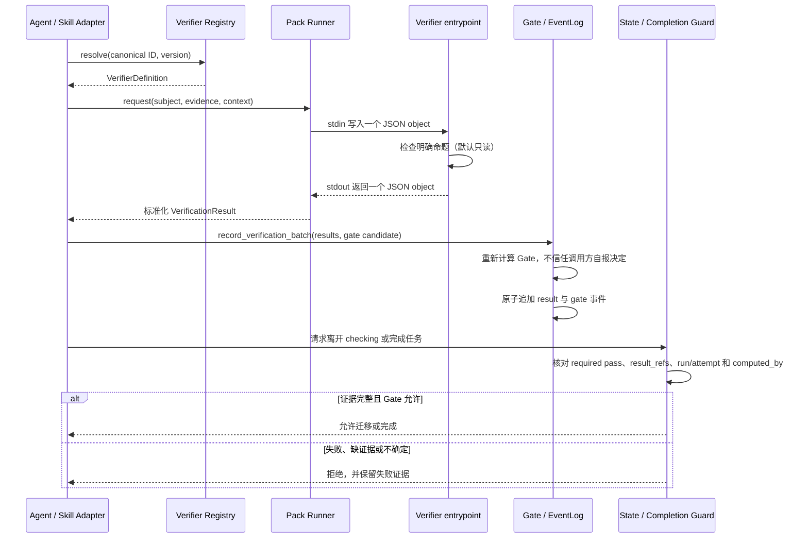
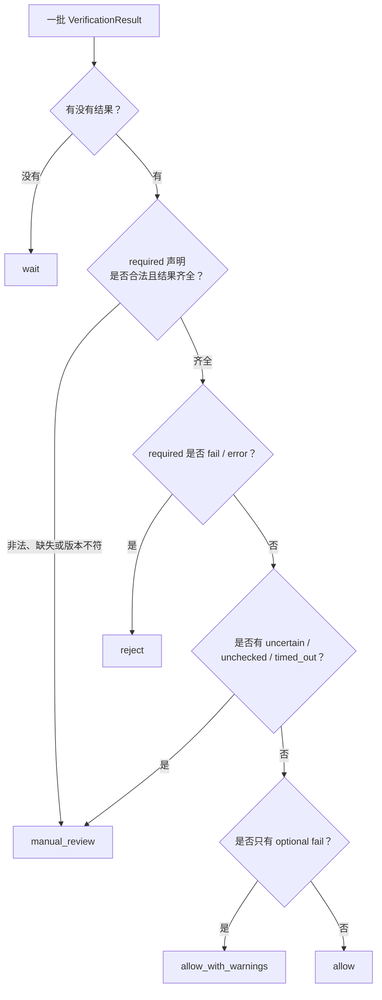

# Bensz Skill Verifier 直观教程

这篇教程回答一个经常被问到的问题：**Verifier（验证器）真正是什么样子，它拿到什么、实际做了什么，又怎样影响一次 Skill 任务能否交付？**

先记住一句话：

> Verifier 默认按只读方式运行，是一个可复核的命题检查器：它根据固定版本的契约检查指定对象和证据，返回结构化结果；Gate 再把一批结果转换成是否放行的决定。

Verifier 不替 Agent 完成任务，也不等于 Gate 或 State。默认的规则组件不修改产物；如果 Pack 声明了 `local_write` 或 `remote_write`，仍必须经过显式副作用授权。它更像交付流水线中的验收工位：生产者先完成工作，验收工位只回答一个边界清楚的问题，并留下机器可读的检查记录。

## 用一个具体例子建立直觉

假设 Agent 准备交付一份报告，合同要求报告对象至少包含 `title` 和 `body`。内置 Verifier `bensz.contract.conformance@1.0.0` 收到的请求可以简化为：

```json
{
  "request_id": "demo-001",
  "subject": {
    "title": "Verifier 教程"
  },
  "context": {
    "required_fields": ["title", "body"]
  }
}
```

这个 Verifier 的规则只做一件事：比较 `required_fields` 与 `subject` 的字段。由于 `body` 缺失，它返回：

```json
{
  "execution_status": "completed",
  "verdict": "fail",
  "facts": {
    "required_fields": ["title", "body"],
    "missing": ["body"]
  },
  "findings": [
    {
      "id": "missing-field",
      "value": "body",
      "verdict": "fail"
    }
  ]
}
```

Kernel 随后补齐 Verifier 的 canonical ID、版本、证据引用等公共字段，并让 Gate 根据“这个 Verifier 是否 required”计算决策。如果它是 required，结果是 `reject`；Agent 应回去补齐 `body`，而不是把 `fail` 改写成 `pass`。

这就是一个 Verifier 的最小本体：

```text
版本化契约 + 默认只读的检查逻辑 + 标准输入 + 标准输出
```

围绕这个本体，Kernel 提供发现、隔离执行、超时、结果规范化、Gate、事件记录与完成态复核等基础设施。

## Verifier、Gate、State 和 Agent 各管什么

这四个对象经常一起出现，但职责不同：

| 对象 | 回答的问题 | 会不会做业务工作 |
| --- | --- | --- |
| Agent / Skill | “报告怎么生成、问题怎么修？” | 会；它是任务执行主体 |
| Verifier | “这个明确命题成立吗？证据是什么？” | 默认不做业务修改；检查并返回结果 |
| Gate | “综合当前 required/advisory 结果，现在能否继续？” | 不会；只计算放行策略 |
| State | “任务现在处于哪个阶段，下一步允许去哪？” | 不会；记录阶段并约束迁移 |

可以把它们理解成：**Agent 生产，Verifier 验货，Gate 放行，State 记阶段，事件账本留凭证。**

Verifier 也不等同于普通测试：测试通常验证某段代码在开发环境里的预期行为；Verifier 验证的是某一次运行中的对象、产物或证据。使用 Contract Pack 的 v2 执行以及写入 EventLog 时，结果会绑定到 `run_id`、`attempt_id`、Verifier 版本和结果事件；兼容的内存 `VerifierRunner` 或未持久化的 v1 结果不必然带有这些运行身份和事件绑定。

## 一次实际验证怎样流过系统

下面是从 Skill 声明要求，到最终允许或阻止交付的完整过程：



再从参与者视角看一次：



这里有一个重要的防伪边界：调用方可以提交一个 Gate 候选对象，但 `EventLog` 不信任其中自报的 `decision`。Kernel 会从已标准化的结果重新计算 Gate，并在事件中写入 `computed_by: kernel` 和所绑定的结果事件 ID。

### 把一个小报告跑完一遍

下面用一个不需要专业背景的例子，把上面的抽象步骤落到一次具体运行中。假设 Agent 刚写好一份报告，Skill 的交付要求是“报告必须有标题和正文”。这次先故意让报告缺少正文，再看它如何被拦下并修正。

| 步骤 | 这次实际发生的事 | 系统留下的结果 |
| --- | --- | --- |
| 1. 声明要求 | Skill 配置 `bensz.contract.conformance@1.0.0`，并标记为 `required`。 | Registry 按 canonical ID 和版本找到对应 Pack。 |
| 2. 准备请求 | Adapter 把报告的最小内容放进 `subject`，把 `title`、`body` 放进 `context.required_fields`。本次 `subject` 只有 `title`。 | 形成带 `run_id`/`attempt_id` 的 `VerificationRequest`。 |
| 3. 隔离执行 | Pack Runner 将请求作为一个 JSON 对象写入脚本的 stdin；脚本只比较字段，不修改报告文件。 | 进程在超时和输出大小限制内结束。 |
| 4. 得到原始判断 | 脚本发现 `body` 不在 `subject` 中，返回 `verdict=fail`，并列出 `missing: ["body"]`；Runner 将这次正常结束标记为 `execution_status=completed`。 | 这是“检查完成但命题不成立”，不是 `error` 或 `unchecked`。 |
| 5. 规范化与 Gate | Kernel 补齐 Verifier ID、版本和证据引用，再按 `required` 重新计算 Gate。 | 结果是 `reject`；调用方即使自报 `allow` 也不会被采信。 |
| 6. 记录并阻止迁移 | EventLog 追加 `verification.result` 和绑定的 `verification.gate`。完成门禁检查到 required 结果失败。 | 状态仍停在 `checking`，不能进入 `delivering`。 |
| 7. 修正后重试 | Agent 给报告补上正文，创建新的 `attempt_id`，重复步骤 2–5。 | 新结果为 `completed + pass`，Gate 变为 `allow`；两次尝试的证据都保留。 |
| 8. 允许交付 | State/Completion Guard 核对通过结果、结果引用、版本和运行身份。 | 迁移到 `delivering`（或完成态）才被接受。 |

第一次请求可以简化写成：

```json
{
  "subject": {"title": "季度安全报告"},
  "context": {"required_fields": ["title", "body"]}
}
```

因此，Runner 规范化结果中的关键部分是：

```json
{
  "execution_status": "completed",
  "verdict": "fail",
  "facts": {"missing": ["body"]}
}
```

Agent 补齐 `body` 后，第二次尝试只改变 `subject` 和 `attempt_id`；契约版本仍是 `1.0.0`。这说明“重试”不是把失败结果改写成通过，而是产生一条新的、可单独审计的验证结果。若第二次执行改为超时或没有返回结果，Gate 会进入 `manual_review`/`wait`，而不会因为第一次失败后又运行过一次就自动放行。

## 一个 Verifier Pack 在磁盘上长什么样

内置 Verifier 位于 [`packages/bensz-skill-kernel/src/bensz_skill_kernel/verifiers/`](../packages/bensz-skill-kernel/src/bensz_skill_kernel/verifiers/)。一个可执行 Pack 的典型结构是：

```text
verifiers/
├── index.json
└── contract-conformance/
    ├── VERIFIER.md
    └── scripts/
        └── verify.py
```

各部分职责如下：

- `index.json`：注册目录名、canonical ID、版本、分类、标签、alias、契约路径，以及 `mode`、`assurance_tier` 和有序 `components`；索引与实际目录必须一致。
- `VERIFIER.md`：面向 Agent 和维护者描述验证命题、输入要求、判断边界与人工步骤。
- `scripts/verify.py`：可选的脚本组件执行入口；stdin 接收一个 JSON object，stdout 只返回一个 JSON object。脚本可以是确定性规则组件，也可以是混合 Pack 中的规则阶段。
- 其它脚本或资源：属于该 Verifier 自己的实现；入口路径必须留在 Pack 目录内，脚本读取其它资源仍应遵循最小授权。

目录隔离不是操作系统安全沙箱。`run_stdio` 会收缩环境变量、限制输入输出大小、控制超时，并默认声明不允许副作用；声明 `local_write`/`remote_write` 的组件仍需显式授权，并通过代码审查和实际权限控制约束其访问范围。不能假设一个恶意脚本仅凭目录结构就无法访问其它文件。

## 混合 Pack 怎样执行

新 Pack 在 `index.json` 中把每个检查者声明成 `script`、`agent` 或 `human` 组件，并用 `depends_on` 固定顺序。`ContractPackExecutor` 先运行可用脚本，把脚本产生的受控 facts 交给后续 Agent/人工 handoff；Kernel 本身不调用模型，也不伪造人工确认。

每个 handoff 都绑定 Pack ID/版本、契约哈希、组件哈希、计划哈希、最小 subject/context、证据摘要、run/attempt、允许工具和副作用边界。外部执行者回传时必须原样带回这些绑定，并声明执行者类型、身份，以及 Agent 的模型或人工确认时间。重复组件、旧契约结果、其它 run/attempt 的结果和未知证据引用都会 fail-closed。

混合合并不使用平均分或投票。对 required 组件而言，脚本 `fail` 会阻断；`uncertain`、超时和错误进入 `manual_review`；未返回的 Agent/人工组件进入 `wait`。optional 组件的失败（且没有其它不确定结果）可得到 `allow_with_warnings`。只有全部 required 组件完成并通过，Verifier 适配器才产生 aggregate `pass` 和 allowing Gate；组件结果与 aggregate 结果分别保留，便于审计和重放。

Skill 专用 Verifier 使用同一契约，但通常由 Skill 自己托管在：

```text
<skill>/references/verifiers/<slug>/
├── VERIFIER.md
└── scripts/verify.py   # 可选
```

Kernel 可以把内置根目录与 Skill 本地根目录合并成只读注册表。物理目录名不是公开身份；稳定身份是 `owner.domain.capability@version`，例如 `bensz.contract.conformance@1.0.0`。

## 输入到底是什么

标准请求由 [`VerificationRequest`](../packages/bensz-skill-kernel/src/bensz_skill_kernel/verifiers.py) 表达，核心字段是：

| 字段 | 含义 | 例子 |
| --- | --- | --- |
| `subject` | 本次要判断的对象或对象描述 | 文件路径、字段对象、状态迁移、变更路径集合 |
| `requirements` | 要满足的要求标识 | `report-has-title` |
| `evidence` | 带来源、时间和内容哈希的证据快照 | 构建日志、来源摘录、文件摘要 |
| `context` | 本 Verifier 所需的只读参数 | 允许路径、Schema、超时、required fields |
| `request_id` | 本次请求的稳定标识 | `run-42:link-check` |

`Evidence` 不只是随手传入的文本。通过 `snapshot_evidence()` 构造快照时，Kernel 会补齐或保留 `source_type`、`collected_at`、`collection_method`、`redacted` 和 `content_hash`，让读者知道证据从哪里来、何时收集、是否脱敏，以及运行后有没有被替换。

真实适配器应尽量只传完成命题所需的最小事实。Verifier 不能因为“检查起来方便”就读取整个仓库、完整用户输入、凭据或无关原始数据。

## 输出到底是什么

标准结果由 [`VerificationResult`](../packages/bensz-skill-kernel/src/bensz_skill_kernel/verifiers.py) 表达。最容易混淆的是 `execution_status` 和 `verdict`：

- `execution_status` 回答“检查有没有正常执行完”。
- `verdict` 回答“被检查的命题是否成立”。

| `execution_status` | 典型 `verdict` | 含义 |
| --- | --- | --- |
| `completed` | `pass` / `fail` / `uncertain` | 检查执行完成，并给出判断 |
| `unchecked` | `unchecked` | 没有实际完成检查，例如只有人工说明而无执行引擎 |
| `timed_out` | `timed_out` | 在限制时间内没有得到结果 |
| `error` | `error` | 执行或输出协议出错 |
| `skipped` | `skipped` | 本次按显式策略跳过 |

结果中的其它重要字段包括：

- `facts`：结构化、可供后续逻辑使用的事实；
- `findings`：具体问题列表，不只是一个总分；
- `evidence_refs`：这次判断实际依赖了哪些证据；
- `uncertainty_reason`：为什么无法形成确定结论；
- `assurance_tier`：结果来自确定性规则、混合流程、LLM judge 还是人工；
- `model_or_engine`、`duration_ms`：语义或外部引擎的执行信息。
- `contract_hash`、`plan_hash`、组件哈希与 `run_id`/`attempt_id`：绑定这次判断实际使用的契约、执行计划和运行身份。

Kernel 明确禁止“未完成但通过”：只要 `execution_status` 不是 `completed`，结果就不能是 `pass`。格式错误不会被猜成成功；内存组件的非法 provider 输出通常规范化为 `unchecked`，而目录入口或 Contract Pack 的非法 JSON/字段通常返回 `error`。

## Gate 怎样把多个结果变成决定

Verifier 只报告局部结果，Gate 才负责放行策略。当前 `apply_gate` 的保守规则可以概括为：



因此，三个常见误解需要避免：

1. 多个 `pass` 不能“投票覆盖”一个 required 的确定性 `fail`。
2. `unchecked` 不是宽松意义上的通过，而是验证缺口，通常进入 `manual_review`。
3. Gate 是对一批结果的策略计算，不是任何单个 Verifier 的内部字段。

## 四种验证方式

Kernel 的公共契约允许四种 `mode`：

| mode | 适合什么 | 当前运行形态 |
| --- | --- | --- |
| `rule` | 字段、Schema、路径、哈希、文件存在等确定性检查 | 通常有本地 entrypoint |
| `prompt` | 需要按 rubric 做语义判断 | 需要外部模型或 Adapter |
| `hybrid` | 规则筛选后再做语义/人工复核 | 组合多个检查组件 |
| `human` | 风险高、证据不足或无法自动化的判断 | `VERIFIER.md` 提供人工说明 |

显式 `agent`/`human` 组件在没有回传结果时会返回 `unchecked` 并产生 handoff；对 required 组件，这会使执行停在 `wait`。没有新组件声明的旧 instruction-only Verifier 仍可发现；在构造 Contract Pack 时会记录“推断执行组件、应声明 components”的迁移诊断，而普通 `FilesystemVerifierRegistry.run()` 主要返回 `unchecked`。Kernel 不会因为契约文档写得很详细，就假装人工或模型判断已经发生。

例如内置 `bensz.evidence.citation-truth-fit@1.0.0` 描述了引用真实性与适切性命题，但 Kernel 不捆绑真实语义引擎；在引擎未接入时，它必须保持 `unchecked`，不能冒充已核验引用。

## 从命令行观察它

安装 `bensz-skill-kernel` 后，可以先查看内置 Verifier：

```bash
bsk verifier list
bsk verifier describe bensz.contract.conformance --version 1.0.0
```

对文件型 Verifier，可以直接执行：

```bash
bsk verifier run bensz.document.markdown-link-integrity \
  --version 1.0.0 \
  --input docs/verifier-tutorial.md \
  --timeout 10
```

该命令用于观察文件型 Pack 的发现、执行和结果结构；它不保证本教程自身得到 `allow`。当前相对文档链接按“链接目标必须位于源 Markdown 所在目录内”检查，因此教程中指向仓库上级 `../packages/...` 的链接会被报告为越界，Gate 可能是 `reject`。若要演示通过路径，应使用只包含本目录内有效链接的 Markdown 文件。

如果同时传入 `--events <task-root>/shared/log/events.ndjson`、`--run-id` 和 `--attempt-id`，CLI 会把结果与 Kernel 计算的 Gate 写入任务事件账本。语义/人工组件未完成时，CLI 顶层会输出完整 `handoffs`；handoff 的契约正文和原始交接内容不作为单独的结果项持久化，但 v2 结果中仍会保留 pending/unchecked 的组件结果摘要。外部宿主完成判断后，Python Adapter 通过 `ComponentHandoff.bind_result()` 生成绑定提交，再调用 `FilesystemVerifierRegistry.run_contract()` 汇总。对于需要自定义 `subject`、`evidence` 或 `context` 的 Verifier，Skill Adapter 通常直接使用 Python API；CLI 的 `--input` 快捷入口主要服务文件对象和 handoff 准备。

`bsk verification` 则用于把一个或多个已有标准结果批量写入事件账本。批量记录在同一账本锁内完成；当调用方同时请求记录 Gate 时，Kernel 只为整批结果计算一个绑定完整 `result_refs` 的 Gate。

## `bensz_skill_kernel` 哪些代码支持哪些功能

下面按一次验证的时间顺序映射到实现。链接指向当前源码；函数名比行号更稳定，适合后续检索。

| 阶段 | 代码与关键对象 | 实际支持的功能 |
| --- | --- | --- |
| 定义公共交接对象 | [`contracts.py`](../packages/bensz-skill-kernel/src/bensz_skill_kernel/contracts.py)：`Subject`、`Requirement`、`Artifact`、`Contract` | 给 Skill、Adapter、Verifier 和 Runtime 提供领域无关的数据形状，避免各自发明不兼容字段 |
| 校验稳定身份 | [`verifier_ids.py`](../packages/bensz-skill-kernel/src/bensz_skill_kernel/verifier_ids.py)：`validate_verifier_id`、`parse_aliases` | 强制 `owner.domain.capability` canonical ID，兼容唯一 alias，但不改写历史身份 |
| 发现 Pack | [`packs.py`](../packages/bensz-skill-kernel/src/bensz_skill_kernel/packs.py)：`load_pack_entries`、`resolve_entrypoint` | 校验 `index.json` 协议、目录与索引一致性、契约/入口不越出 Pack 目录 |
| 编排公共组件 | [`contract_packs.py`](../packages/bensz-skill-kernel/src/bensz_skill_kernel/contract_packs.py)：`ContractPack`、`ContractPackExecutor`、`ComponentHandoff`、`ComponentResult` | 计算契约/计划/组件哈希，执行脚本，准备 Agent/人工交接，验证提交身份、证据和顺序，并保守合并公共执行状态 |
| 解析 Verifier 契约 | [`verifiers.py`](../packages/bensz-skill-kernel/src/bensz_skill_kernel/verifiers.py)：`VerifierDefinition`、`VerifierSpec` | 从索引和 `VERIFIER.md` 解析 ID、版本、mode、assurance、标签、alias、入口和说明 |
| 注册和解析版本 | [`verifiers.py`](../packages/bensz-skill-kernel/src/bensz_skill_kernel/verifiers.py)：`FilesystemVerifierRegistry`、`CombinedVerifierRegistry`、`PackRegistry` | 发现内置/Skill 本地 Verifier，解析 canonical/alias，按版本定位定义，拒绝重复与冲突 |
| 建立请求与证据快照 | [`verifiers.py`](../packages/bensz-skill-kernel/src/bensz_skill_kernel/verifiers.py)：`Evidence`、`VerificationRequest`、`snapshot_evidence` | 固化证据内容哈希与来源元数据；`VerificationRequest` 校验 subject/context 为对象并校验协议版本 |
| 安全执行入口 | [`packs.py`](../packages/bensz-skill-kernel/src/bensz_skill_kernel/packs.py)：`run_stdio` | 使用 JSON-stdio 运行本地入口；限制工作目录、环境变量、输入/输出/错误大小与超时，并终止超时进程组 |
| 执行目录型 Verifier | [`verifiers.py`](../packages/bensz-skill-kernel/src/bensz_skill_kernel/verifiers.py)：`FilesystemVerifierRegistry.run` / `run_contract` | 解析目标版本；兼容旧单入口，并让新组件 Pack 通过公共执行器运行或生成 handoff |
| 执行组件型 Pack | [`verifiers.py`](../packages/bensz-skill-kernel/src/bensz_skill_kernel/verifiers.py)：`VerifierRunner.run` | 运行内存注册的 rule/prompt 组件，检查必需证据，把 provider 异常变成结果数据而不是让整个 Runtime 崩溃 |
| 规范化输出 | [`verifiers.py`](../packages/bensz-skill-kernel/src/bensz_skill_kernel/verifiers.py)：`VerificationResult`、`VerifierContractAdapter`、`normalize_result` | 保留组件结果与 aggregate 结果的边界，限制 execution/verdict 枚举，阻止“未完成却 pass” |
| 计算 Gate | [`verifiers.py`](../packages/bensz-skill-kernel/src/bensz_skill_kernel/verifiers.py)：`GateDecision`、`apply_gate`、`normalize_requirements` | 规范化 Skill 的 required/advisory 声明，检查 ID/版本/缺失结果，保守输出 allow、warning、reject、wait 或 manual review |
| 提供通用规则 | [`atomic_verifiers.py`](../packages/bensz-skill-kernel/src/bensz_skill_kernel/atomic_verifiers.py)：`run_atomic` | 实现合同字段、路径范围、Schema、diff、脱敏、证据来源、事件完整性、状态迁移和任务完整性等领域无关命题 |
| 提供内置兼容注册 | [`builtins.py`](../packages/bensz-skill-kernel/src/bensz_skill_kernel/builtins.py)：`build_builtin_registry` | 为 Python API 保留内存 Pack 注册入口；新目录型调用优先走 filesystem registry |
| 暴露 CLI | [`cli.py`](../packages/bensz-skill-kernel/src/bensz_skill_kernel/cli.py)：`_run_verifier_command`、`verification` 分支 | 提供 `bsk verifier list/describe/run` 和批量 `bsk verification`，输出结构化 JSON，可选写入事件账本 |
| 持久化结果与 Gate | [`runtime.py`](../packages/bensz-skill-kernel/src/bensz_skill_kernel/runtime.py)：`EventLog.record_verification`、`record_verification_batch` | 在追加式事件账本中记录结果/Gate；v2 会复核组件哈希、运行身份、执行者、证据和 required 状态，再由 Kernel 重算 Gate |
| 约束状态迁移 | [`states.py`](../packages/bensz-skill-kernel/src/bensz_skill_kernel/states.py)：`check_state_invariants`、`SkillStateDeclaration` | 从 Skill runtime 声明解析 Verifier requirements；离开检查态前核对结果/Gate、required pass、运行身份与结果绑定 |
| 阻止伪完成 | [`runtime.py`](../packages/bensz-skill-kernel/src/bensz_skill_kernel/runtime.py)：`_guard_completion` | 完成前再次检查 required Verifier、allowing Gate、`computed_by: kernel`、`result_refs`、结果事件 ID、run/attempt 与不确定结果 |
| 导出公共 API | [`__init__.py`](../packages/bensz-skill-kernel/src/bensz_skill_kernel/__init__.py) | 汇总 Adapter 可稳定导入的 Verifier、State、Contract、Runtime 和 Workspace 类型 |

这张代码地图也体现了 Kernel 的边界：`packs.py` 管安全执行边界，`verifiers.py` 管验证协议与 Gate，`runtime.py` 管事件和完成治理，`states.py` 管阶段迁移约束；具体领域“什么算正确”仍属于各 Verifier Pack，而不是硬编码进 Kernel reducer。

## 失败时系统会怎样

Verifier 的失败路径是设计的一部分，不是异常角落：

- **命题不成立**：`execution_status=completed`、`verdict=fail`；required 时 Gate `reject`。
- **缺少 required 结果或版本不匹配**：Gate `manual_review`，不能静默放行。
- **入口超时**：`timed_out`；保留超时原因，不能升级为 `pass`。
- **输出不是合法 JSON 或字段非法**：目录入口/Contract Pack 通常是 `error`，内存组件的规范化路径可能是 `unchecked`；调用方需要修复 Pack/Adapter。
- **只有人工说明、没有执行引擎**：`unchecked`；等待人工或接入真实引擎。
- **optional Verifier 失败**：在没有 required 失败和不确定结果时，可得到 `allow_with_warnings`。
- **有人伪造 allowing Gate**：完成门禁会重算并检查 `computed_by`、`result_refs` 和结果事件绑定，拒绝不一致记录。
- **组件漏跑、重复提交、同版本契约漂移或历史运行串台**：组件绑定校验拒绝结果，`verification-v2` 不能形成 allowing Gate。

Agent 收到这些结果后可以修正产物、补证据、进入 `waiting` 或报告失败，但不能修改历史事件来制造通过。

## 什么时候值得引入 Verifier

Verifier 是可选基础设施。以下条件同时越明确，收益通常越高：

- 有一个稳定、边界清楚、可以复述为“是否……”的命题；
- 失败会影响交付、安全、合规或后续自动化；
- 输入事实和通过条件能够版本化；
- 检查可以只读完成，并能留下可复核证据；
- 多个 Skill 会重复需要同一命题，或单个 Skill 需要可靠的阶段门禁。

如果只是一次性的主观建议、没有可靠证据、无法校准的开放式审美判断，或者验证成本高于错误成本，就不应为了“看起来完整”强行创建 Verifier。普通 Skill 开发也不默认要求接入 Verifier 或 State。

## 最小心智模型

以后看到一个 Verifier，可以按六个问题快速判断它是否真实工作：

1. **它证明的唯一命题是什么？** 如果一句话说不清，范围可能过大。
2. **输入对象和证据是什么？** 是否最小、可追溯、已脱敏？
3. **谁真正执行了判断？** 规则脚本、外部模型、混合流程还是人工？
4. **它返回的是 pass/fail，还是其实 unchecked/uncertain？** 不要混淆执行完成与命题成立。
5. **Gate 为什么放行或阻止？** required、版本和缺失结果是否被正确考虑？
6. **结果写到哪里并绑定了什么？** 应能找到版本、run/attempt、证据引用、结果事件和 Kernel 计算的 Gate。

如果这六个问题都有明确答案，Verifier 就不是文档里的抽象名词，而是一条可执行、可失败、可重放、可审计的验收链。想继续理解它怎样约束阶段迁移，可接着阅读 [`state-machine-tutorial.md`](state-machine-tutorial.md)。
