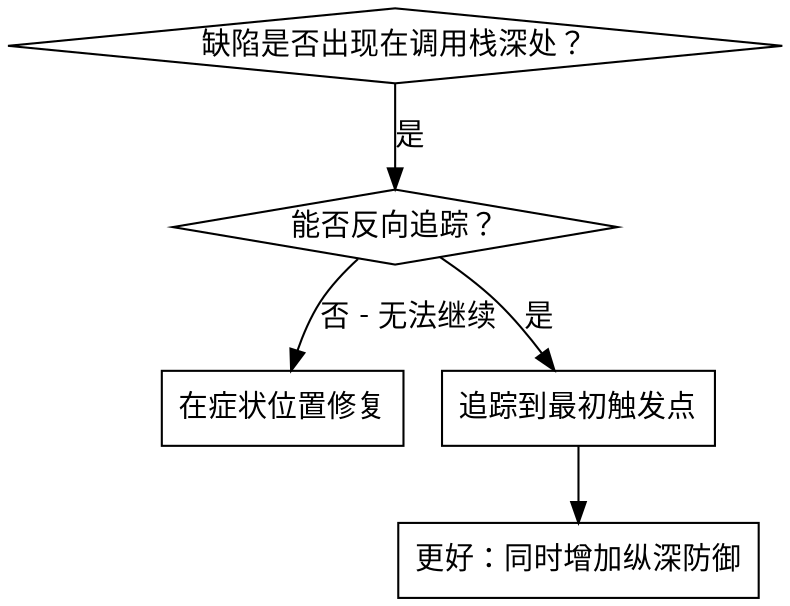
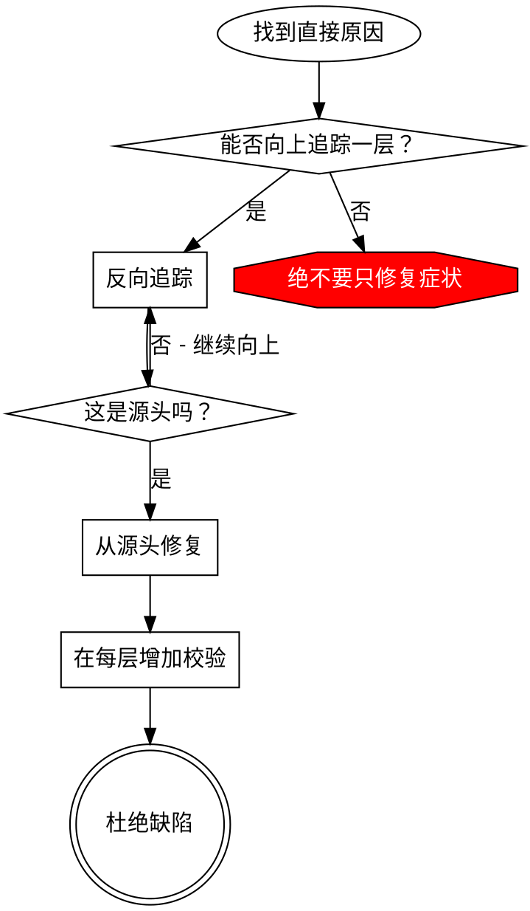

# 根因追踪

## 概述

缺陷经常在调用栈深处暴露（例如 `git init` 在错误目录执行、文件创建在错误位置，或数据库以错误路径打开）。人们往往会直接修复报错出现的位置，但这只是在处理症状。

**核心原则：**沿调用链反向追踪，直到找到最初触发点，再从源头修复。

## 适用场景



**适用于：**
- 错误发生在执行过程深处，而不是入口点
- 堆栈显示出很长的调用链
- 不清楚无效数据从何而来
- 需要找出触发问题的测试或代码

## 追踪流程

### 1. 观察症状
```
Error: git init failed in /Users/jesse/project/packages/core
```

### 2. 找到直接原因
**哪段代码直接导致了这个问题？**
```typescript
await execFileAsync('git', ['init'], { cwd: projectDir });
```

### 3. 追问：是谁调用了它？
```typescript
WorktreeManager.createSessionWorktree(projectDir, sessionId)
  → 由 Session.initializeWorkspace() 调用
  → 由 Session.create() 调用
  → 由 Project.create() 处的测试调用
```

### 4. 继续向上追踪
**传入了什么值？**
- `projectDir = ''`（空字符串！）
- 空字符串作为 `cwd` 会解析为 `process.cwd()`
- 这就是源代码目录！

### 5. 找到最初触发点
**空字符串从何而来？**
```typescript
const context = setupCoreTest(); // Returns { tempDir: '' }
Project.create('name', context.tempDir); // Accessed before beforeEach!
```

## 添加堆栈追踪

无法手动追踪时，添加检测代码：

```typescript
// 在有问题的操作之前
async function gitInit(directory: string) {
  const stack = new Error().stack;
  console.error('DEBUG git init:', {
    directory,
    cwd: process.cwd(),
    nodeEnv: process.env.NODE_ENV,
    stack,
  });

  await execFileAsync('git', ['init'], { cwd: directory });
}
```

**关键：**在测试中使用 `console.error()`（不要使用 logger，它可能不会显示）。

**运行并捕获输出：**
```bash
npm test 2>&1 | grep 'DEBUG git init'
```

**分析堆栈：**
- 查找测试文件名
- 找到触发调用的行号
- 识别模式（是否是同一个测试或参数？）

## 找出造成污染的测试

如果测试期间出现了某个异常产物，但不知道是哪个测试造成的：

使用本目录中的二分定位脚本 `find-polluter.sh`：

```bash
./find-polluter.sh '.git' 'src/**/*.test.ts'
```

该脚本逐个运行测试，在发现第一个污染源时停止。用法请参见脚本内容。

## 真实示例：空的 projectDir

**症状：**`.git` 被创建在 `packages/core/`（源代码目录）中。

**追踪链：**
1. `git init` 在 `process.cwd()` 中执行 ← `cwd` 参数为空
2. WorktreeManager 收到空的 projectDir
3. Session.create() 收到空字符串
4. 测试在 beforeEach 之前访问了 `context.tempDir`
5. setupCoreTest() 初始返回 `{ tempDir: '' }`

**根因：**顶层变量初始化时访问了空值。

**修复：**将 tempDir 改为 getter，在 beforeEach 之前访问时抛出异常。

**同时增加纵深防御：**
- 第 1 层：Project.create() 校验目录
- 第 2 层：WorkspaceManager 校验目录非空
- 第 3 层：NODE_ENV 防护拒绝在 tmpdir 外执行 git init
- 第 4 层：在 git init 前记录堆栈

## 核心原则



**绝不要只修复报错出现的位置。**应反向追踪，找到最初触发点。

## 堆栈追踪技巧

**在测试中：**使用 `console.error()` 而不是 logger——logger 可能被抑制。
**操作之前：**在危险操作前记录，而不是失败后才记录。
**包含上下文：**目录、cwd、环境变量和时间戳。
**捕获堆栈：**`new Error().stack` 可显示完整调用链。

## 实际影响

来自一次调试会话（2025-10-03）：
- 通过 5 层追踪找到根因
- 从源头修复（getter 校验）
- 增加 4 层防御
- 1847 个测试通过，零污染
